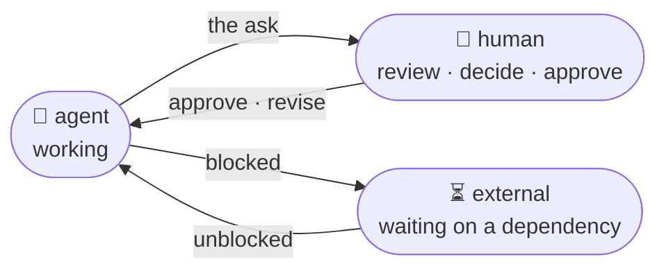
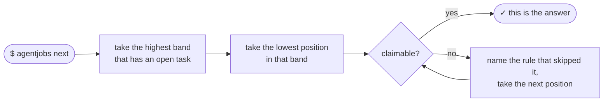
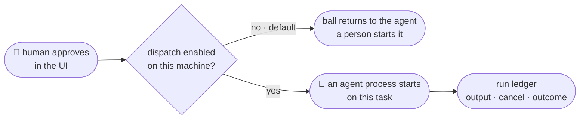

# AgentJobs

**Structure and tracking for building with coding agents — on your machine, across as
many sessions as you can run.**

Prototyping with an agent is fast until the third session, when nothing remembers what's
done, what's half-done, or what's waiting on you. AgentJobs is the record that outlives
the session: a durable record naming who has the ball and what they're being asked to
do — kept in a database beside the server, outside every checkout, so every session and
every branch is looking at the same backlog.

## The ball is always somewhere

Agents are stateless. A session ends and its memory is gone — so the *record* has to
carry the work, and it has to say who is on the hook right now.



Three places the ball can be, and **there is no fourth**. No "unassigned", no backlog
limbo, no task quietly belonging to nobody. Every open task names one of these, and every
arrow carries what the next holder is being asked to do — both enforced by the schema, so
a record that breaks either does not load.

## "What should I work on" has exactly one answer

Not a sort over timestamps that reshuffles the backlog whenever an agent logs progress.
Position is a stored decision, inside a priority band, and asking is deterministic:



`--why` prints that reasoning instead of hiding it — the winner, and every task it walked
past with the rule that skipped each. When you disagree, you move the task, and the move
is recorded with your reason, so the next session inherits the decision instead of
re-deriving it.

## It closes the loop

A tracker with an MCP server can record that a human approved something. It cannot turn
that approval into a running agent, in the right directory, with the right context.



Dispatch is off unless a machine-local file turns it on, and the command it runs must be
defined in that file — so a repository can never choose what executes on your machine.
That gate is what makes the schema load-bearing rather than descriptive.

## It is opinionated, and the schema does the arguing

Most trackers are a bag of fields and a convention document nobody reads. AgentJobs
takes positions, and each one is enforced by the model rather than by a habit — the
broken state is *unrepresentable*, so a file in it does not load. Three that matter:

**A task cannot sit unassigned.** `ball` is absent if and only if the task is closed, so
every open task names who acts next — an agent, a human, or an external dependency.
There is no "unassigned" column and no task quietly belonging to nobody. The state that
every other tracker lets you reach does not exist here.

**A handoff cannot be silent.** `ball_prompt` is required whenever the ball is set. You
cannot throw work over a wall without saying what you want; a handoff with no ask is a
notification with no payload, and the schema rejects it. (One deliberate exemption: a
task in the ready pool, where the spec is itself the ask.)

**Every open task has a place in line.** `queue_position` is present if and only if the
task is open — that part the model enforces. Uniqueness inside a priority band it cannot
see (one file cannot check another), so placement happens under a lock and
`agentjobs queue check` reports any collision history left behind. The effect either way:
*"what should I work on"* always has exactly one answer, and that answer is a decision
somebody stored — not a sort over `updated` that silently reorders your backlog every
time an agent logs progress.

That last one is what makes the interesting command possible:

```console
$ agentjobs next --why
task-045  [high/300]
  Close the double-claim race

Ahead of it, and why each was skipped (3):
    100  task-031
        not ready (active, held by agent)
    200  task-038
        not ready (draft, held by human)
    250  task-041
        has 2 open children
```

It does not just answer. It shows its work: the band and position the winner stands at,
and every task it walked past with the rule that excluded each. When you disagree, you
move the task and the move is recorded with your reason — so the next session inherits
the decision instead of re-deriving it.

### The rest of the opinions

- **State moves through verbs, never through a patch.** No interface has a
  `set_lifecycle` or a `set_queue_position`, and no patch route accepts a state axis —
  not the REST API, not MCP, not the CLI, not the web UI. Work is claimed, handed off,
  released, promoted or closed, and each verb appends its own log entry, so the record
  shows *why* it moved and not merely *that* it did.
- **Retries are safe and stale writes are refused.** Send the same `operation_id` twice
  and the second replays the first result instead of writing again. Send an edit computed
  from a version somebody has since changed and it is refused, rather than silently
  overwriting them.
- **Hierarchy means something.** A parent with open children is skipped by `next` — it is
  not what to start — but it can still be claimed by name, and claiming one hands back a
  *supervision* prompt, not a work prompt. The umbrella is a job, and it is a different
  job from its children.
- **The record is readable, and it is not writable.** Agents read whole records freely --
  `agentjobs show` prints one as JSON, the REST API serves it, and
  `agentjobs storage export` writes the backlog out as the same task YAML it imports. Every
  change goes through a managed path that validates, locks and logs. A hand-edited record
  that looks right and is not is the failure this prevents.
- **The storage is a database beside the server, and there is only the one.** Records are
  rows in a per-project SQLite file under `~/.agentjobs/`, outside every checkout, so no
  task file ever appears in your repository. That is what ends the
  branch-decides-the-backlog coupling — concurrent sessions on different branches see one
  backlog — and what makes a historical question a query rather than a walk through git
  history. `agentjobs storage status` says where each project's records are, counted
  rather than assumed; [the storage guide](docs/storage-sqlite.md) is the whole argument,
  including what was given up to get here.

**And it closes the loop.** A tracker with an MCP server can record that a human approved
something. It cannot turn that approval into a running agent, in the right directory,
with the right context. AgentJobs can — dispatch is off by default, gated by
machine-local configuration a repository cannot supply, and it is what makes the schema
load-bearing rather than descriptive.

## Resuming with no chat history

The handoff is a few fields on the task, and they are the fields a returning agent reads
first:

```yaml
lifecycle: active
ball: human
ball_reason: review
ball_prompt: Review the diff; approve or request changes.
```

A fresh agent resumes from the record alone: the specification, the current ask, the
decision and question log, and the acceptance criteria. That
[resumption contract](docs/schema-design.md#the-resumption-contract) was tested on
2026-08-11 — a zero-context headless agent reconstructed the work and found three
defects in the dispatch design that the humans who wrote it had missed. The evidence is
on task-060 in this project's own store, which is where every record lives.

## Agents connect over MCP

```bash
git clone https://github.com/jeffposey/agentjobs.git && cd agentjobs
poetry install && poetry run agentjobs serve
```

Then point any MCP client at `agentjobs mcp`. Fifteen tools cover discovery, the whole
claim/handoff/release/close loop, the queue, the append-only log, and zero-context
resumption — each one validated, locked and logged by the same code the UI writes
through.

Claude Code and Codex each get a bundled plugin with a workflow skill and a hook that
refuses direct writes to task files. Every client gets `agentjobs validate`, the portable
backstop. [What each layer does and does not prevent](docs/mcp.md#what-protects-what)
is written down rather than implied.

## The React application

The primary human interface is a responsive React application at `/app/`. It is
designed for desktop and laptop browsers, tablets, and phones, so a reviewer can
inspect task details, create tasks, approve work, or request changes from the device
that is convenient at the time.

The React UI adapts rather than merely shrinking: navigation and action groups stack
on smaller screens, wide task tables become labelled cards, and interactive controls
retain touch-friendly sizing. Over private HTTPS, the same application can be
installed from a phone or tablet browser as a Progressive Web App (PWA). See
[Mobile and installed-app access](docs/mobile-access.md) for the secure setup and its
network-only task-data behavior.

The production React bundle is included in the Python package. Running an installed
release therefore requires Python, but not Node, npm, a separate frontend server, or
a particular desktop operating system.

## What works today

- Schema-v2 task records with lifecycle, ball, outcome, typed logs, acceptance criteria,
  dependencies, parent relationships, and strict validation
- A FastAPI REST API and Python client for claiming, handing off, releasing, closing,
  querying, and logging work
- A packaged React web application for desktop browsers, tablets, and phones, with
  a project switcher for multiple registered projects, task creation and detail pages,
  hierarchy roll-ups, and human review actions
- **An explicit work queue.** Order is a stored field, not a sort over timestamps:
  `agentjobs next --why` names what is first and every task it passed over with the rule
  that excluded each, and `agentjobs queue move` records the decision so the next session
  inherits it rather than re-deriving it
- **Agent dispatch.** A human decision can start a supervised agent process, with
  machine-local runner configuration, per-project enablement, a run ledger with
  cancellation and startup reconciliation, and four safety gates. Optionally, an approval
  can run the whole rebase/gate/merge/restart close-out with no agent in the loop
- A CLI covering create, list, show, next, promote, work, validate, the queue and
  dispatch command groups, project registration, the MCP server, and server control
- Markdown-to-YAML and schema-v1-to-v2 migration tools
- **Per-project storage.** Every project's records are rows in a SQLite database of its
  own beside the server, with preview, one-way import of an existing YAML corpus,
  verified backup, restore and export under the same command group

The Python client and REST API expose the full schema-v2 state verbs. The CLI has no
dedicated `claim`/`handoff`/`release`/`close` command — those remain backlog work, and
agents reach them over MCP; the React application is the primary human interface.

## The design is part of the product

The project records decisions and rejected alternatives before implementation, rather
than leaving the rationale in a chat transcript:

- [Task schema v2](docs/schema-design.md) decides how a task becomes sufficient working
  memory for a zero-context agent, including the ball model and canonical handoff loop.
- [Agent dispatch](docs/agent-dispatch-design.md) is the design record for turning
  authorized task state into a supervised agent process, with bounded autonomy and
  explicit safety gates. Its shipped sections identify their implementation tasks;
  [durable execution](docs/agent-dispatch-design.md#9a-durable-execution-an-accepted-dispatch-survives-its-processes-task-414)
  is the proposed next increment, with recovery contracts and fault-injection criteria.
- [Codex dispatch rollout](docs/codex-dispatch.md) documents the current Codex
  runner setup and rollout sequence.
- [Durable Codex dispatch architecture](docs/codex-dispatch-architecture.md)
  separates dispatch, resumability, and Desktop-visibility contracts.
- [Agent loops](docs/agent-loops-design.md) is a design record with **no implementation
  yet**, and says so at the top. Its contribution is an evaluable stopping condition and
  durable iteration history, not another `while true` wrapper. The design pass closed as
  task-078; the implementation tasks derived from it are open and unclaimed, and appear
  on [the roadmap](ROADMAP.md).

## Installation

AgentJobs requires Python 3.11 or newer and is not yet published to PyPI. Run it from a
clone; Node is needed only for contributors building the React bundle, never to install
or run a release wheel:

```bash
git clone https://github.com/jeffposey/agentjobs.git
cd agentjobs
poetry install
npm --prefix frontend ci && npm --prefix frontend run build
```

The `npm` line builds the React bundle. It is gitignored and no `poetry install`
produces it, so from a clone it is a required step for the web UI — a release wheel
ships with it already built and needs no Node. Everything else (the CLI, the REST API,
the MCP server) works without it.

## Quick start

```bash
# From the AgentJobs clone, explore the project's own task data
poetry run agentjobs open

# Or initialize another project while using the cloned package
cd /path/to/your-project
poetry -P /path/to/agentjobs run agentjobs init

# Start the server and open the packaged React application in a browser
poetry -P /path/to/agentjobs run agentjobs open
```

`init` gives the project a database of its own beside the server and creates no task
directory, so no task file ever appears in your repository and the server is what the
CLI talks to. Arriving with a corpus of task YAML from an older version?
[The import](docs/storage-sqlite.md#9-importing-an-existing-corpus) takes it once, and
[the storage guide](docs/storage-sqlite.md) says what a record still is once it is a row.

From the AgentJobs clone, useful commands include:

```bash
poetry run agentjobs create --ready --title "Describe the work" --priority high
poetry run agentjobs list --lifecycle ready
poetry run agentjobs show task-001
poetry run agentjobs next --why          # what to work on, and why not the other one
poetry run agentjobs work --agent my-agent

poetry run agentjobs status
poetry run agentjobs restart --reload
poetry run agentjobs stop
```

Without `--ready` a task is born `draft`, which is deliberately not claimable — so
`list --lifecycle ready` would print nothing and `work` would report "No tasks
available". `agentjobs promote <id>` is the same step taken later.

Register more than one project with the same local server:

```bash
poetry run agentjobs project add /path/to/another/project
poetry run agentjobs project list
```

## Python client

The Python client exposes the schema-v2 state verbs even though dedicated CLI commands
for each verb are still planned:

```python
from agentjobs import Ball, BallReason, TaskClient

with TaskClient() as client:
    task = client.get_next_task(agent="my-agent")
    if task:
        client.claim_task(task.id, agent="my-agent")

        # Work, verify, and record decisions here.

        client.handoff_task(
            task.id,
            actor="my-agent",
            ball=Ball.HUMAN,
            ball_reason=BallReason.REVIEW,
            ball_prompt="Review the diff and approve or request changes.",
        )
```

## Documentation

- [Task schema reference](docs/task-schema.md)
- [Agent workflow guide](docs/agent-workflow.md)
- [API reference](docs/api-reference.md)
- [Quick start](docs/quickstart.md)
- [Installation guide](docs/installation.md)
- [Mobile and installed-app access](docs/mobile-access.md)
- [Migration guide](docs/migration-guide.md)
- [SQLite storage guide](docs/storage-sqlite.md)
- [Task corpus audit](docs/task-corpus-audit.md)

## Development

AgentJobs uses itself to manage its own development, and the records are the source of
truth -- not a chat log. They live in a database beside the server;
`agentjobs storage status` prints the path, and
[the storage guide](docs/storage-sqlite.md) is why.

This repository's own backlog was imported on 2026-09-07, and the frozen copy it was built
from was removed on 2026-09-11 (task-380) the way
[the storage guide's section 10](docs/storage-sqlite.md#10-retiring-an-imported-corpus)
describes. **So there is no `tasks/` directory here, and a clone does not arrive with the
records.** That is deliberate rather than an omission: a frozen copy that still looks
authoritative is the thing somebody reads six months later and acts on. Git history holds
the files if you need them, and `agentjobs storage export` writes the current records out
as YAML without checking anything out.

**[ROADMAP.md](ROADMAP.md) is what to read instead.** A database beside a server is the
right home for a backlog and the wrong shop window for a public repository, so the open
work is projected into one tracked file: every ready and in-progress task, in the order
the queue hands it out, with what each one is waiting on. It is generated by
`scripts/export_roadmap.py`, nothing reads it back, and the `roadmap` stage of
`scripts/check.py` fails when the committed copy no longer matches the store — the same
contract `openapi.json` is held to. Regenerate it rather than editing it:

```bash
poetry run python scripts/export_roadmap.py ROADMAP.md
```

```bash
git clone https://github.com/jeffposey/agentjobs.git
cd agentjobs
python scripts/bootstrap.py
poetry run python scripts/check.py
poetry run agentjobs open
```

`scripts/bootstrap.py` is the supported setup for any fresh checkout, clone or git
worktree: `poetry install`, `npm ci`, the Playwright browser, and a check that the
environment imports this checkout's source rather than a neighbouring one's. The gate's
`build` stage leaves a frontend bundle behind, which is why `open` works on the line
after it.

The React application's source and focused development commands live under
`frontend/`:

```bash
cd frontend
npm install
npm run check
```

The repository commit gate is `poetry run python scripts/check.py` from the root. It
runs ten stages, cheapest first: formatting, lint, types, the generated API contract,
the generated PWA icons, the frontend linter, then the Python suite, the Vitest
component suite, the production build, and the Playwright suite against a live server. `scripts/check.py --list` prints
them; `--from <stage>` resumes after a late failure without paying for the stages that
already passed. The unqualified command runs all ten, and that is the one the commit
rule means. `npm run check` is the focused frontend half of the gate. Run
`npm run generate:api` when an intentional backend contract change needs to be recorded.

During development Vite serves it at `http://localhost:5173/app/` and proxies API
requests to AgentJobs on port 8765. After `npm run build`, FastAPI serves the same app
at `http://localhost:8765/app` with deep-link fallback. The production output lives
inside the Python package at `src/agentjobs/frontend_dist/`, which is also where an
installed wheel resolves it.

Build release artifacts with `poetry run python scripts/build_release.py`. That command
reinstalls the locked frontend toolchain, creates a fresh bundle, invokes Poetry, and
verifies the finished wheel contains the React shell, hashed assets, manifest, icons,
and service worker. Node is required to create a release, but never to install or run
the universal wheel; `pip install agentjobs` followed by `agentjobs serve` is a
Python-only runtime path. Do not publish artifacts made through an alternate command—
the release script is the freshness and package-content gate. It enforces a
`py3-none-any` wheel and boots the installed server with Node removed from `PATH`.

Read [ENGINEERING.md](ENGINEERING.md) and [ALLAGENTS.md](ALLAGENTS.md) before
contributing; they define the worktree, task-record, verification, and human-review
workflow.

## License

MIT License — see [LICENSE](LICENSE).
