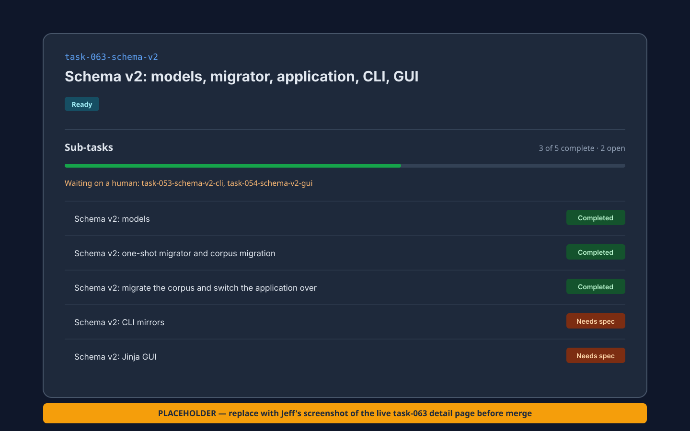

# AgentJobs

**A git-backed handoff protocol for work that outlives an agent session.**

Agents are often stateless: a new session starts with no memory of the last one. AgentJobs
makes the task record the durable working memory. Every open task names who has the ball,
why they have it, and what they need to do next. A handoff without an ask is invalid.

A fresh agent resumes from the record alone: the specification, the current ask, the
decision and question log, and the acceptance criteria. That
[resumption contract](docs/schema-design.md#the-resumption-contract) has been exercised
with a zero-context agent, which reconstructed the work and found defects in the design
that dispatched it.



> **Screenshot placeholder:** replace this image with Jeff's capture of
> `task-063-schema-v2` before merge. The live page shows a five-child hierarchy, a 60%
> roll-up, two tasks waiting on a human, and each child's derived status.

## Why this is not another task tracker

- **The ball is required state.** `ball`, `ball_reason`, and `ball_prompt` make “who acts
  next, why, and what do they need?” queryable. An open task cannot silently fall into
  limbo.
- **The record is a resumption contract.** Specs, handoffs, decisions, open questions,
  and acceptance live together in one record so another agent can continue without chat
  history.
- **Hierarchy has workflow meaning.** Parent tasks roll up their children and are not
  claimable while a child remains open. The UI shows child progress and each child's
  derived status.
- **Git is the database.** One YAML file per task keeps work diffable, reviewable, and
  portable between tools without adding a service to operate.

AgentJobs is for developers coordinating coding agents across short-lived sessions,
especially when a human must review, decide, or approve between passes.

## What works today

- Schema-v2 task records with lifecycle, ball, outcome, typed logs, acceptance criteria,
  dependencies, parent relationships, and strict validation
- A FastAPI REST API and Python client for claiming, handing off, releasing, closing,
  querying, and logging work
- A server-rendered web UI with multiple registered projects, task detail pages,
  hierarchy roll-ups, and human review actions
- Basic CLI workflows for creating, listing, showing, claiming/finishing interactively,
  serving, and migrating tasks
- Markdown-to-YAML and schema-v1-to-v2 migration tools

The full schema-v2 command vocabulary and the remaining schema-v2 GUI views are still
open work. See [task-053](tasks/agentjobs/task-053-schema-v2-cli.yaml) and
[task-054](tasks/agentjobs/task-054-schema-v2-gui.yaml).

## The design is part of the product

The project records decisions and rejected alternatives before implementation, rather
than leaving the rationale in a chat transcript:

- [Task schema v2](docs/schema-design.md) decides how a task becomes sufficient working
  memory for a zero-context agent, including the ball model and canonical handoff loop.
- [Agent dispatch](docs/agent-dispatch-design.md) is the accepted, **not yet implemented**
  design for turning authorized task state into a supervised agent process, with bounded
  autonomy and explicit safety gates.

Agent loops are also **not implemented**. Their design pass is queued in
[task-078](tasks/agentjobs/task-078-agent-loops.yaml); the proposed contribution is an
evaluable stopping condition and durable iteration history, not another `while true`
wrapper. No agent-loops design document exists yet.

## Installation

AgentJobs requires Python 3.11 or newer.

```bash
pip install agentjobs
```

For local development from a clone:

```bash
poetry install
```

## Quick start

```bash
# Initialize task storage in a project
cd /path/to/your-project
agentjobs init

# Start the local UI and open it in a browser
agentjobs open
```

Useful commands:

```bash
agentjobs create --title "Describe the work" --priority high
agentjobs list --lifecycle ready
agentjobs show task-001
agentjobs work --agent my-agent

agentjobs status
agentjobs restart --reload
agentjobs stop
```

Register more than one project with the same local server:

```bash
agentjobs project add /path/to/another/project
agentjobs project list
```

## Python client

The Python client exposes the schema-v2 state verbs even though dedicated CLI commands
for each verb are still planned:

```python
from agentjobs import Ball, BallReason, TaskClient

with TaskClient() as client:
    task = client.get_next_task(agent="my-agent")
    if task:
        client.claim_task(task.id, agent="my-agent")

        # Work, verify, and record decisions here.

        client.handoff_task(
            task.id,
            actor="my-agent",
            ball=Ball.HUMAN,
            ball_reason=BallReason.REVIEW,
            ball_prompt="Review the diff and approve or request changes.",
        )
```

## Documentation

- [Task schema reference](docs/task-schema.md)
- [Agent workflow guide](docs/agent-workflow.md)
- [API reference](docs/api-reference.md)
- [Quick start](docs/quickstart.md)
- [Installation guide](docs/installation.md)
- [Migration guide](docs/migration-guide.md)

## Development

AgentJobs uses itself to manage its own development. The roadmap lives in
[`tasks/agentjobs/`](tasks/agentjobs/), and the task YAML is the source of truth.

```bash
git clone https://github.com/jeffposey/agentjobs.git
cd agentjobs
poetry install
poetry run pytest
poetry run agentjobs serve
```

Read [ENGINEERING.md](ENGINEERING.md) and [ALLAGENTS.md](ALLAGENTS.md) before
contributing; they define the worktree, task-record, verification, and human-review
workflow.

## License

MIT License — see [LICENSE](LICENSE).
