# Schema v1 -- entity diagram

Generated by `gen-erdiagram` from `schema/agentjobs-v1.yaml`, rendered to SVG by `mmdc`.
Do not hand-edit -- run `scripts/regen-schema-docs.sh`.

**[Open the full-size SVG](agentjobs-v1.er.svg)** to pan and zoom natively
in your browser. Or click the diagram below to zoom it in place.

[](agentjobs-v1.er.svg)

??? note "Mermaid source"

    ```mermaid
    erDiagram
    Branch {
        string name  
        datetime merged_at  
        string status  
    }
    Comment {
        string id  
        string author  
        string content  
        datetime created  
        string kind  
        string reply_to  
        string task_id  
        datetime updated  
    }
    Deliverable {
        string description  
        string path  
        string status  
    }
    Dependency {
        string note  
        string status  
        string task_id  
        string type  
    }
    ExternalLink {
        string title  
        string url  
    }
    Issue {
        string id  
        string resolution  
        string status  
        string title  
    }
    Phase {
        string id  
        datetime completed_at  
        string notes  
        TaskStatus status  
        string title  
    }
    Prompt {
        string author  
        string content  
        string context  
        string prompt_file  
        datetime timestamp  
    }
    Prompts {
        string starter  
    }
    StatusUpdate {
        string author  
        string details  
        TaskStatus status  
        string summary  
        datetime timestamp  
    }
    SuccessCriterion {
        string id  
        string description  
        string status  
    }
    Task {
        string id  
        string description  
        string assigned_to  
        string category  
        datetime created  
        string estimated_effort  
        string human_summary  
        Priority priority  
        TaskStatus status  
        stringList tags  
        string title  
        datetime updated  
    }
    
    Prompts ||--}o Prompt : "followups"
    Task ||--|o Prompts : "prompts"
    Task ||--}o Branch : "branches"
    Task ||--}o Comment : "comments"
    Task ||--}o Deliverable : "deliverables"
    Task ||--}o Dependency : "dependencies"
    Task ||--}o ExternalLink : "external_links"
    Task ||--}o Issue : "issues"
    Task ||--}o Phase : "phases"
    Task ||--}o StatusUpdate : "status_updates"
    Task ||--}o SuccessCriterion : "success_criteria"
    
    ```
    
