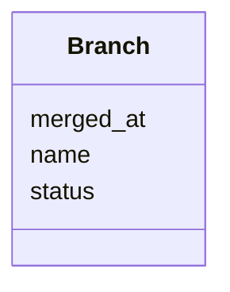

---
search:
  boost: 10.0
---

# Class: Branch 


_Branch lifecycle metadata._


<div data-search-exclude markdown="1">


URI: [aj:class/Branch](https://github.com/jeffposey/agentjobs/schema/v1/class/Branch)





<!-- no inheritance hierarchy -->

## Slots

| Name | Cardinality and Range | Description | Inheritance |
| ---  | --- | --- | --- |
| [name](../slots/name.md) | 1 <br/> [String](../types/String.md) | Git branch name associated with the task | direct |
| [status](../slots/status.md) | 0..1 <br/> [String](../types/String.md) | Validated against active | merged | abandoned but typed as a bare str | direct |
| [merged_at](../slots/merged_at.md) | 0..1 <br/> [Datetime](../types/Datetime.md) | When the branch was merged, if applicable | direct |


## Usages

| used by | used in | type | used |
| ---  | --- | --- | --- |
| [Task](../classes/Task.md) | [branches](../slots/branches.md) | range | [Branch](../classes/Branch.md) |


## Identifier and Mapping Information


### Schema Source


* from schema: https://github.com/jeffposey/agentjobs/schema/v1


## Mappings

| Mapping Type | Mapped Value |
| ---  | ---  |
| self | aj:Branch |
| native | aj:Branch |


## LinkML Source

<!-- TODO: investigate https://stackoverflow.com/questions/37606292/how-to-create-tabbed-code-blocks-in-mkdocs-or-sphinx -->

### Direct

<details>
```yaml
name: Branch
description: Branch lifecycle metadata.
from_schema: https://github.com/jeffposey/agentjobs/schema/v1
attributes:
  name:
    name: name
    description: Git branch name associated with the task.
    from_schema: https://github.com/jeffposey/agentjobs/schema/v1
    rank: 1000
    domain_of:
    - Branch
    required: true
  status:
    name: status
    description: Validated against active | merged | abandoned but typed as a bare
      str. Genuinely distinct from the task vocabulary; survives into v2 unchanged.
    from_schema: https://github.com/jeffposey/agentjobs/schema/v1
    ifabsent: string(active)
    domain_of:
    - Task
    - Phase
    - SuccessCriterion
    - StatusUpdate
    - Deliverable
    - Dependency
    - Issue
    - Branch
  merged_at:
    name: merged_at
    description: When the branch was merged, if applicable.
    from_schema: https://github.com/jeffposey/agentjobs/schema/v1
    rank: 1000
    domain_of:
    - Branch
    range: datetime

```
</details>

### Induced

<details>
```yaml
name: Branch
description: Branch lifecycle metadata.
from_schema: https://github.com/jeffposey/agentjobs/schema/v1
attributes:
  name:
    name: name
    description: Git branch name associated with the task.
    from_schema: https://github.com/jeffposey/agentjobs/schema/v1
    rank: 1000
    owner: Branch
    domain_of:
    - Branch
    range: string
    required: true
  status:
    name: status
    description: Validated against active | merged | abandoned but typed as a bare
      str. Genuinely distinct from the task vocabulary; survives into v2 unchanged.
    from_schema: https://github.com/jeffposey/agentjobs/schema/v1
    ifabsent: string(active)
    owner: Branch
    domain_of:
    - Task
    - Phase
    - SuccessCriterion
    - StatusUpdate
    - Deliverable
    - Dependency
    - Issue
    - Branch
    range: string
  merged_at:
    name: merged_at
    description: When the branch was merged, if applicable.
    from_schema: https://github.com/jeffposey/agentjobs/schema/v1
    rank: 1000
    owner: Branch
    domain_of:
    - Branch
    range: datetime

```
</details></div>