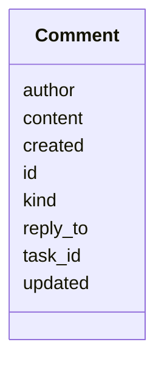

---
search:
  boost: 10.0
---

# Class: Comment 


_Comment on a task for human-agent communication. Deleted in v2, subsumed by the unified log._


<div data-search-exclude markdown="1">


URI: [aj:class/Comment](https://github.com/jeffposey/agentjobs/schema/v1/class/Comment)





<!-- no inheritance hierarchy -->

## Slots

| Name | Cardinality and Range | Description | Inheritance |
| ---  | --- | --- | --- |
| [id](../slots/id.md) | 1 <br/> [String](../types/String.md) | Unique comment identifier | direct |
| [task_id](../slots/task_id.md) | 1 <br/> [String](../types/String.md) | Task this comment belongs to | direct |
| [author](../slots/author.md) | 1 <br/> [String](../types/String.md) | Author of the comment (human or agent) | direct |
| [content](../slots/content.md) | 1 <br/> [String](../types/String.md) | Comment text content | direct |
| [created](../slots/created.md) | 1 <br/> [Datetime](../types/Datetime.md) | When the comment was created | direct |
| [updated](../slots/updated.md) | 0..1 <br/> [Datetime](../types/Datetime.md) | Last update timestamp if edited | direct |
| [reply_to](../slots/reply_to.md) | 0..1 <br/> [String](../types/String.md) | Parent comment ID if this is a reply | direct |
| [kind](../slots/kind.md) | 0..1 <br/> [String](../types/String.md) | Documents comment | feedback | question in its description and enforces nothi... | direct |


## Usages

| used by | used in | type | used |
| ---  | --- | --- | --- |
| [Task](../classes/Task.md) | [comments](../slots/comments.md) | range | [Comment](../classes/Comment.md) |


## Identifier and Mapping Information


### Schema Source


* from schema: https://github.com/jeffposey/agentjobs/schema/v1


## Mappings

| Mapping Type | Mapped Value |
| ---  | ---  |
| self | aj:Comment |
| native | aj:Comment |


## LinkML Source

<!-- TODO: investigate https://stackoverflow.com/questions/37606292/how-to-create-tabbed-code-blocks-in-mkdocs-or-sphinx -->

### Direct

<details>
```yaml
name: Comment
description: Comment on a task for human-agent communication. Deleted in v2, subsumed
  by the unified log.
from_schema: https://github.com/jeffposey/agentjobs/schema/v1
attributes:
  id:
    name: id
    description: Unique comment identifier.
    from_schema: https://github.com/jeffposey/agentjobs/schema/v1
    domain_of:
    - Task
    - Phase
    - SuccessCriterion
    - Comment
    - Issue
    - Webhook
    required: true
  task_id:
    name: task_id
    description: Task this comment belongs to. Redundant -- the comment is already
      nested inside that task's file.
    from_schema: https://github.com/jeffposey/agentjobs/schema/v1
    rank: 1000
    domain_of:
    - Comment
    - Dependency
    required: true
  author:
    name: author
    description: Author of the comment (human or agent). Free text.
    from_schema: https://github.com/jeffposey/agentjobs/schema/v1
    domain_of:
    - Prompt
    - StatusUpdate
    - Comment
    required: true
  content:
    name: content
    description: Comment text content.
    from_schema: https://github.com/jeffposey/agentjobs/schema/v1
    domain_of:
    - Prompt
    - Comment
    required: true
  created:
    name: created
    description: When the comment was created.
    from_schema: https://github.com/jeffposey/agentjobs/schema/v1
    domain_of:
    - Task
    - Comment
    - Webhook
    range: datetime
    required: true
  updated:
    name: updated
    description: Last update timestamp if edited. Written by update_content(), which
      raises NameError -- models.py never imports timezone (see task-047).
    from_schema: https://github.com/jeffposey/agentjobs/schema/v1
    domain_of:
    - Task
    - Comment
    range: datetime
  reply_to:
    name: reply_to
    description: Parent comment ID if this is a reply.
    from_schema: https://github.com/jeffposey/agentjobs/schema/v1
    rank: 1000
    domain_of:
    - Comment
  kind:
    name: kind
    description: Documents comment | feedback | question in its description and enforces
      nothing. One of v1's two unvalidated free-text vocabularies.
    from_schema: https://github.com/jeffposey/agentjobs/schema/v1
    rank: 1000
    ifabsent: string(comment)
    domain_of:
    - Comment

```
</details>

### Induced

<details>
```yaml
name: Comment
description: Comment on a task for human-agent communication. Deleted in v2, subsumed
  by the unified log.
from_schema: https://github.com/jeffposey/agentjobs/schema/v1
attributes:
  id:
    name: id
    description: Unique comment identifier.
    from_schema: https://github.com/jeffposey/agentjobs/schema/v1
    owner: Comment
    domain_of:
    - Task
    - Phase
    - SuccessCriterion
    - Comment
    - Issue
    - Webhook
    range: string
    required: true
  task_id:
    name: task_id
    description: Task this comment belongs to. Redundant -- the comment is already
      nested inside that task's file.
    from_schema: https://github.com/jeffposey/agentjobs/schema/v1
    rank: 1000
    owner: Comment
    domain_of:
    - Comment
    - Dependency
    range: string
    required: true
  author:
    name: author
    description: Author of the comment (human or agent). Free text.
    from_schema: https://github.com/jeffposey/agentjobs/schema/v1
    owner: Comment
    domain_of:
    - Prompt
    - StatusUpdate
    - Comment
    range: string
    required: true
  content:
    name: content
    description: Comment text content.
    from_schema: https://github.com/jeffposey/agentjobs/schema/v1
    owner: Comment
    domain_of:
    - Prompt
    - Comment
    range: string
    required: true
  created:
    name: created
    description: When the comment was created.
    from_schema: https://github.com/jeffposey/agentjobs/schema/v1
    owner: Comment
    domain_of:
    - Task
    - Comment
    - Webhook
    range: datetime
    required: true
  updated:
    name: updated
    description: Last update timestamp if edited. Written by update_content(), which
      raises NameError -- models.py never imports timezone (see task-047).
    from_schema: https://github.com/jeffposey/agentjobs/schema/v1
    owner: Comment
    domain_of:
    - Task
    - Comment
    range: datetime
  reply_to:
    name: reply_to
    description: Parent comment ID if this is a reply.
    from_schema: https://github.com/jeffposey/agentjobs/schema/v1
    rank: 1000
    owner: Comment
    domain_of:
    - Comment
    range: string
  kind:
    name: kind
    description: Documents comment | feedback | question in its description and enforces
      nothing. One of v1's two unvalidated free-text vocabularies.
    from_schema: https://github.com/jeffposey/agentjobs/schema/v1
    rank: 1000
    ifabsent: string(comment)
    owner: Comment
    domain_of:
    - Comment
    range: string

```
</details></div>