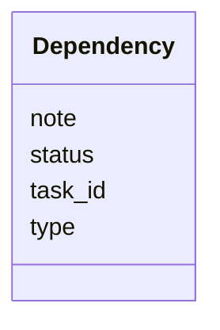

---
search:
  boost: 10.0
---

# Class: Dependency 


_Relationship metadata between tasks._


<div data-search-exclude markdown="1">


URI: [aj:class/Dependency](https://github.com/jeffposey/agentjobs/schema/v1/class/Dependency)





<!-- no inheritance hierarchy -->

## Slots

| Name | Cardinality and Range | Description | Inheritance |
| ---  | --- | --- | --- |
| [task_id](../slots/task_id.md) | 1 <br/> [String](../types/String.md) | Referenced task identifier | direct |
| [type](../slots/type.md) | 0..1 <br/> [String](../types/String.md) | Relationship type, validated against depends_on | blocks | related but typed ... | direct |
| [status](../slots/status.md) | 0..1 <br/> [String](../types/String.md) | Optional[str] with no validator, no documented vocabulary, and no discernible... | direct |
| [note](../slots/note.md) | 0..1 <br/> [String](../types/String.md) | Additional notes about the dependency | direct |


## Usages

| used by | used in | type | used |
| ---  | --- | --- | --- |
| [Task](../classes/Task.md) | [dependencies](../slots/dependencies.md) | range | [Dependency](../classes/Dependency.md) |


## Identifier and Mapping Information


### Schema Source


* from schema: https://github.com/jeffposey/agentjobs/schema/v1


## Mappings

| Mapping Type | Mapped Value |
| ---  | ---  |
| self | aj:Dependency |
| native | aj:Dependency |


## LinkML Source

<!-- TODO: investigate https://stackoverflow.com/questions/37606292/how-to-create-tabbed-code-blocks-in-mkdocs-or-sphinx -->

### Direct

<details>
```yaml
name: Dependency
description: Relationship metadata between tasks.
from_schema: https://github.com/jeffposey/agentjobs/schema/v1
attributes:
  task_id:
    name: task_id
    description: Referenced task identifier. Not validated against the store, so a
      dependency can name a task that does not exist.
    from_schema: https://github.com/jeffposey/agentjobs/schema/v1
    domain_of:
    - Comment
    - Dependency
    required: true
  type:
    name: type
    description: Relationship type, validated against depends_on | blocks | related
      but typed as a bare str.
    from_schema: https://github.com/jeffposey/agentjobs/schema/v1
    rank: 1000
    ifabsent: string(depends_on)
    domain_of:
    - Dependency
  status:
    name: status
    description: Optional[str] with no validator, no documented vocabulary, and no
      discernible purpose given type already carries the relationship. Deleted in
      v2.
    from_schema: https://github.com/jeffposey/agentjobs/schema/v1
    domain_of:
    - Task
    - Phase
    - SuccessCriterion
    - StatusUpdate
    - Deliverable
    - Dependency
    - Issue
    - Branch
  note:
    name: note
    description: Additional notes about the dependency.
    from_schema: https://github.com/jeffposey/agentjobs/schema/v1
    rank: 1000
    domain_of:
    - Dependency

```
</details>

### Induced

<details>
```yaml
name: Dependency
description: Relationship metadata between tasks.
from_schema: https://github.com/jeffposey/agentjobs/schema/v1
attributes:
  task_id:
    name: task_id
    description: Referenced task identifier. Not validated against the store, so a
      dependency can name a task that does not exist.
    from_schema: https://github.com/jeffposey/agentjobs/schema/v1
    owner: Dependency
    domain_of:
    - Comment
    - Dependency
    range: string
    required: true
  type:
    name: type
    description: Relationship type, validated against depends_on | blocks | related
      but typed as a bare str.
    from_schema: https://github.com/jeffposey/agentjobs/schema/v1
    rank: 1000
    ifabsent: string(depends_on)
    owner: Dependency
    domain_of:
    - Dependency
    range: string
  status:
    name: status
    description: Optional[str] with no validator, no documented vocabulary, and no
      discernible purpose given type already carries the relationship. Deleted in
      v2.
    from_schema: https://github.com/jeffposey/agentjobs/schema/v1
    owner: Dependency
    domain_of:
    - Task
    - Phase
    - SuccessCriterion
    - StatusUpdate
    - Deliverable
    - Dependency
    - Issue
    - Branch
    range: string
  note:
    name: note
    description: Additional notes about the dependency.
    from_schema: https://github.com/jeffposey/agentjobs/schema/v1
    rank: 1000
    owner: Dependency
    domain_of:
    - Dependency
    range: string

```
</details></div>