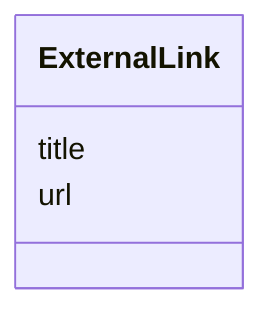

---
search:
  boost: 10.0
---

# Class: ExternalLink 


_Reference to a relevant external resource._


<div data-search-exclude markdown="1">


URI: [aj:class/ExternalLink](https://github.com/jeffposey/agentjobs/schema/v1/class/ExternalLink)





<!-- no inheritance hierarchy -->

## Slots

| Name | Cardinality and Range | Description | Inheritance |
| ---  | --- | --- | --- |
| [url](../slots/url.md) | 1 <br/> [String](../types/String.md) | External resource URL | direct |
| [title](../slots/title.md) | 1 <br/> [String](../types/String.md) | Display title for the external resource | direct |


## Usages

| used by | used in | type | used |
| ---  | --- | --- | --- |
| [Task](../classes/Task.md) | [external_links](../slots/external_links.md) | range | [ExternalLink](../classes/ExternalLink.md) |


## Identifier and Mapping Information


### Schema Source


* from schema: https://github.com/jeffposey/agentjobs/schema/v1


## Mappings

| Mapping Type | Mapped Value |
| ---  | ---  |
| self | aj:ExternalLink |
| native | aj:ExternalLink |


## LinkML Source

<!-- TODO: investigate https://stackoverflow.com/questions/37606292/how-to-create-tabbed-code-blocks-in-mkdocs-or-sphinx -->

### Direct

<details>
```yaml
name: ExternalLink
description: Reference to a relevant external resource.
from_schema: https://github.com/jeffposey/agentjobs/schema/v1
attributes:
  url:
    name: url
    description: External resource URL. Typed as a bare str -- never actually validated
      as a URL, unlike Webhook.url which uses HttpUrl.
    from_schema: https://github.com/jeffposey/agentjobs/schema/v1
    rank: 1000
    domain_of:
    - ExternalLink
    - Webhook
    required: true
  title:
    name: title
    description: Display title for the external resource.
    from_schema: https://github.com/jeffposey/agentjobs/schema/v1
    domain_of:
    - Task
    - Phase
    - ExternalLink
    - Issue
    required: true

```
</details>

### Induced

<details>
```yaml
name: ExternalLink
description: Reference to a relevant external resource.
from_schema: https://github.com/jeffposey/agentjobs/schema/v1
attributes:
  url:
    name: url
    description: External resource URL. Typed as a bare str -- never actually validated
      as a URL, unlike Webhook.url which uses HttpUrl.
    from_schema: https://github.com/jeffposey/agentjobs/schema/v1
    rank: 1000
    owner: ExternalLink
    domain_of:
    - ExternalLink
    - Webhook
    range: string
    required: true
  title:
    name: title
    description: Display title for the external resource.
    from_schema: https://github.com/jeffposey/agentjobs/schema/v1
    owner: ExternalLink
    domain_of:
    - Task
    - Phase
    - ExternalLink
    - Issue
    range: string
    required: true

```
</details></div>