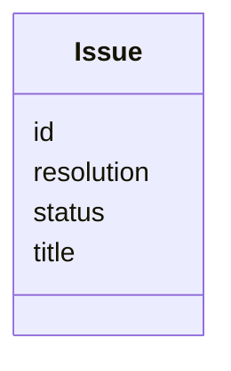

---
search:
  boost: 10.0
---

# Class: Issue 


_Issue tracked against the task's lifecycle. Empty in all 25 corpus files; deleted in v2._


<div data-search-exclude markdown="1">


URI: [aj:class/Issue](https://github.com/jeffposey/agentjobs/schema/v1/class/Issue)





<!-- no inheritance hierarchy -->

## Slots

| Name | Cardinality and Range | Description | Inheritance |
| ---  | --- | --- | --- |
| [id](../slots/id.md) | 1 <br/> [String](../types/String.md) | Issue identifier scoped to the task | direct |
| [title](../slots/title.md) | 1 <br/> [String](../types/String.md) | Concise issue summary | direct |
| [status](../slots/status.md) | 0..1 <br/> [String](../types/String.md) | Validated against open | in_progress | resolved | wont_fix but typed as a bar... | direct |
| [resolution](../slots/resolution.md) | 0..1 <br/> [String](../types/String.md) | Resolution notes when an issue is closed | direct |


## Usages

| used by | used in | type | used |
| ---  | --- | --- | --- |
| [Task](../classes/Task.md) | [issues](../slots/issues.md) | range | [Issue](../classes/Issue.md) |


## Identifier and Mapping Information


### Schema Source


* from schema: https://github.com/jeffposey/agentjobs/schema/v1


## Mappings

| Mapping Type | Mapped Value |
| ---  | ---  |
| self | aj:Issue |
| native | aj:Issue |


## LinkML Source

<!-- TODO: investigate https://stackoverflow.com/questions/37606292/how-to-create-tabbed-code-blocks-in-mkdocs-or-sphinx -->

### Direct

<details>
```yaml
name: Issue
description: Issue tracked against the task's lifecycle. Empty in all 25 corpus files;
  deleted in v2.
from_schema: https://github.com/jeffposey/agentjobs/schema/v1
attributes:
  id:
    name: id
    description: Issue identifier scoped to the task.
    from_schema: https://github.com/jeffposey/agentjobs/schema/v1
    domain_of:
    - Task
    - Phase
    - SuccessCriterion
    - Comment
    - Issue
    - Webhook
    required: true
  title:
    name: title
    description: Concise issue summary.
    from_schema: https://github.com/jeffposey/agentjobs/schema/v1
    domain_of:
    - Task
    - Phase
    - ExternalLink
    - Issue
    required: true
  status:
    name: status
    description: Validated against open | in_progress | resolved | wont_fix but typed
      as a bare str. A fifth parallel status vocabulary.
    from_schema: https://github.com/jeffposey/agentjobs/schema/v1
    ifabsent: string(open)
    domain_of:
    - Task
    - Phase
    - SuccessCriterion
    - StatusUpdate
    - Deliverable
    - Dependency
    - Issue
    - Branch
  resolution:
    name: resolution
    description: Resolution notes when an issue is closed.
    from_schema: https://github.com/jeffposey/agentjobs/schema/v1
    rank: 1000
    domain_of:
    - Issue

```
</details>

### Induced

<details>
```yaml
name: Issue
description: Issue tracked against the task's lifecycle. Empty in all 25 corpus files;
  deleted in v2.
from_schema: https://github.com/jeffposey/agentjobs/schema/v1
attributes:
  id:
    name: id
    description: Issue identifier scoped to the task.
    from_schema: https://github.com/jeffposey/agentjobs/schema/v1
    owner: Issue
    domain_of:
    - Task
    - Phase
    - SuccessCriterion
    - Comment
    - Issue
    - Webhook
    range: string
    required: true
  title:
    name: title
    description: Concise issue summary.
    from_schema: https://github.com/jeffposey/agentjobs/schema/v1
    owner: Issue
    domain_of:
    - Task
    - Phase
    - ExternalLink
    - Issue
    range: string
    required: true
  status:
    name: status
    description: Validated against open | in_progress | resolved | wont_fix but typed
      as a bare str. A fifth parallel status vocabulary.
    from_schema: https://github.com/jeffposey/agentjobs/schema/v1
    ifabsent: string(open)
    owner: Issue
    domain_of:
    - Task
    - Phase
    - SuccessCriterion
    - StatusUpdate
    - Deliverable
    - Dependency
    - Issue
    - Branch
    range: string
  resolution:
    name: resolution
    description: Resolution notes when an issue is closed.
    from_schema: https://github.com/jeffposey/agentjobs/schema/v1
    rank: 1000
    owner: Issue
    domain_of:
    - Issue
    range: string

```
</details></div>