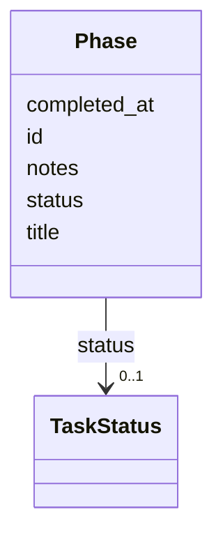

---
search:
  boost: 10.0
---

# Class: Phase 


_Discrete phase within a task roadmap._


<div data-search-exclude markdown="1">


URI: [aj:class/Phase](https://github.com/jeffposey/agentjobs/schema/v1/class/Phase)





<!-- no inheritance hierarchy -->

## Slots

| Name | Cardinality and Range | Description | Inheritance |
| ---  | --- | --- | --- |
| [id](../slots/id.md) | 1 <br/> [String](../types/String.md) | Phase identifier (e | direct |
| [title](../slots/title.md) | 1 <br/> [String](../types/String.md) | Human-readable phase title | direct |
| [status](../slots/status.md) | 0..1 <br/> [TaskStatus](../enums/TaskStatus.md) | Phase status, reusing the full 8-value task vocabulary -- including values su... | direct |
| [notes](../slots/notes.md) | 0..1 <br/> [String](../types/String.md) | Optional free-form notes about the phase | direct |
| [completed_at](../slots/completed_at.md) | 0..1 <br/> [Datetime](../types/Datetime.md) | Timestamp when the phase reached completion | direct |


## Usages

| used by | used in | type | used |
| ---  | --- | --- | --- |
| [Task](../classes/Task.md) | [phases](../slots/phases.md) | range | [Phase](../classes/Phase.md) |


## Identifier and Mapping Information


### Schema Source


* from schema: https://github.com/jeffposey/agentjobs/schema/v1


## Mappings

| Mapping Type | Mapped Value |
| ---  | ---  |
| self | aj:Phase |
| native | aj:Phase |


## LinkML Source

<!-- TODO: investigate https://stackoverflow.com/questions/37606292/how-to-create-tabbed-code-blocks-in-mkdocs-or-sphinx -->

### Direct

<details>
```yaml
name: Phase
description: Discrete phase within a task roadmap.
from_schema: https://github.com/jeffposey/agentjobs/schema/v1
attributes:
  id:
    name: id
    description: Phase identifier (e.g. phase-1).
    from_schema: https://github.com/jeffposey/agentjobs/schema/v1
    domain_of:
    - Task
    - Phase
    - SuccessCriterion
    - Comment
    - Issue
    - Webhook
    required: true
  title:
    name: title
    description: Human-readable phase title.
    from_schema: https://github.com/jeffposey/agentjobs/schema/v1
    domain_of:
    - Task
    - Phase
    - ExternalLink
    - Issue
    required: true
  status:
    name: status
    description: Phase status, reusing the full 8-value task vocabulary -- including
      values such as archived that cannot meaningfully apply to a phase.
    from_schema: https://github.com/jeffposey/agentjobs/schema/v1
    ifabsent: string(draft)
    domain_of:
    - Task
    - Phase
    - SuccessCriterion
    - StatusUpdate
    - Deliverable
    - Dependency
    - Issue
    - Branch
    range: TaskStatus
  notes:
    name: notes
    description: Optional free-form notes about the phase.
    from_schema: https://github.com/jeffposey/agentjobs/schema/v1
    rank: 1000
    domain_of:
    - Phase
  completed_at:
    name: completed_at
    description: Timestamp when the phase reached completion.
    from_schema: https://github.com/jeffposey/agentjobs/schema/v1
    rank: 1000
    domain_of:
    - Phase
    range: datetime

```
</details>

### Induced

<details>
```yaml
name: Phase
description: Discrete phase within a task roadmap.
from_schema: https://github.com/jeffposey/agentjobs/schema/v1
attributes:
  id:
    name: id
    description: Phase identifier (e.g. phase-1).
    from_schema: https://github.com/jeffposey/agentjobs/schema/v1
    owner: Phase
    domain_of:
    - Task
    - Phase
    - SuccessCriterion
    - Comment
    - Issue
    - Webhook
    range: string
    required: true
  title:
    name: title
    description: Human-readable phase title.
    from_schema: https://github.com/jeffposey/agentjobs/schema/v1
    owner: Phase
    domain_of:
    - Task
    - Phase
    - ExternalLink
    - Issue
    range: string
    required: true
  status:
    name: status
    description: Phase status, reusing the full 8-value task vocabulary -- including
      values such as archived that cannot meaningfully apply to a phase.
    from_schema: https://github.com/jeffposey/agentjobs/schema/v1
    ifabsent: string(draft)
    owner: Phase
    domain_of:
    - Task
    - Phase
    - SuccessCriterion
    - StatusUpdate
    - Deliverable
    - Dependency
    - Issue
    - Branch
    range: TaskStatus
  notes:
    name: notes
    description: Optional free-form notes about the phase.
    from_schema: https://github.com/jeffposey/agentjobs/schema/v1
    rank: 1000
    owner: Phase
    domain_of:
    - Phase
    range: string
  completed_at:
    name: completed_at
    description: Timestamp when the phase reached completion.
    from_schema: https://github.com/jeffposey/agentjobs/schema/v1
    rank: 1000
    owner: Phase
    domain_of:
    - Phase
    range: datetime

```
</details></div>