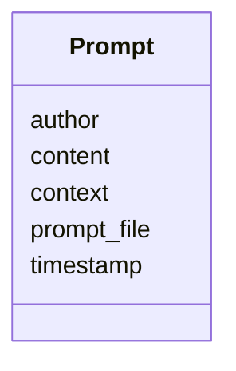

---
search:
  boost: 10.0
---

# Class: Prompt 


_Individual prompt entry for a task._


<div data-search-exclude markdown="1">


URI: [aj:class/Prompt](https://github.com/jeffposey/agentjobs/schema/v1/class/Prompt)





<!-- no inheritance hierarchy -->

## Slots

| Name | Cardinality and Range | Description | Inheritance |
| ---  | --- | --- | --- |
| [timestamp](../slots/timestamp.md) | 1 <br/> [Datetime](../types/Datetime.md) | Timestamp for when the prompt was issued | direct |
| [author](../slots/author.md) | 1 <br/> [String](../types/String.md) | Author of the prompt (agent or human name) | direct |
| [prompt_file](../slots/prompt_file.md) | 0..1 <br/> [String](../types/String.md) | Optional path reference to the prompt file | direct |
| [content](../slots/content.md) | 0..1 <br/> [String](../types/String.md) | Inline prompt content when not referencing a file | direct |
| [context](../slots/context.md) | 0..1 <br/> [String](../types/String.md) | Additional context regarding the prompt | direct |


## Usages

| used by | used in | type | used |
| ---  | --- | --- | --- |
| [Prompts](../classes/Prompts.md) | [followups](../slots/followups.md) | range | [Prompt](../classes/Prompt.md) |


## Identifier and Mapping Information


### Schema Source


* from schema: https://github.com/jeffposey/agentjobs/schema/v1


## Mappings

| Mapping Type | Mapped Value |
| ---  | ---  |
| self | aj:Prompt |
| native | aj:Prompt |


## LinkML Source

<!-- TODO: investigate https://stackoverflow.com/questions/37606292/how-to-create-tabbed-code-blocks-in-mkdocs-or-sphinx -->

### Direct

<details>
```yaml
name: Prompt
description: Individual prompt entry for a task.
from_schema: https://github.com/jeffposey/agentjobs/schema/v1
attributes:
  timestamp:
    name: timestamp
    description: Timestamp for when the prompt was issued.
    from_schema: https://github.com/jeffposey/agentjobs/schema/v1
    rank: 1000
    domain_of:
    - Prompt
    - StatusUpdate
    range: datetime
    required: true
  author:
    name: author
    description: Author of the prompt (agent or human name).
    from_schema: https://github.com/jeffposey/agentjobs/schema/v1
    rank: 1000
    domain_of:
    - Prompt
    - StatusUpdate
    - Comment
    required: true
  prompt_file:
    name: prompt_file
    description: Optional path reference to the prompt file.
    from_schema: https://github.com/jeffposey/agentjobs/schema/v1
    rank: 1000
    domain_of:
    - Prompt
  content:
    name: content
    description: Inline prompt content when not referencing a file.
    from_schema: https://github.com/jeffposey/agentjobs/schema/v1
    rank: 1000
    domain_of:
    - Prompt
    - Comment
  context:
    name: context
    description: Additional context regarding the prompt.
    from_schema: https://github.com/jeffposey/agentjobs/schema/v1
    rank: 1000
    domain_of:
    - Prompt

```
</details>

### Induced

<details>
```yaml
name: Prompt
description: Individual prompt entry for a task.
from_schema: https://github.com/jeffposey/agentjobs/schema/v1
attributes:
  timestamp:
    name: timestamp
    description: Timestamp for when the prompt was issued.
    from_schema: https://github.com/jeffposey/agentjobs/schema/v1
    rank: 1000
    owner: Prompt
    domain_of:
    - Prompt
    - StatusUpdate
    range: datetime
    required: true
  author:
    name: author
    description: Author of the prompt (agent or human name).
    from_schema: https://github.com/jeffposey/agentjobs/schema/v1
    rank: 1000
    owner: Prompt
    domain_of:
    - Prompt
    - StatusUpdate
    - Comment
    range: string
    required: true
  prompt_file:
    name: prompt_file
    description: Optional path reference to the prompt file.
    from_schema: https://github.com/jeffposey/agentjobs/schema/v1
    rank: 1000
    owner: Prompt
    domain_of:
    - Prompt
    range: string
  content:
    name: content
    description: Inline prompt content when not referencing a file.
    from_schema: https://github.com/jeffposey/agentjobs/schema/v1
    rank: 1000
    owner: Prompt
    domain_of:
    - Prompt
    - Comment
    range: string
  context:
    name: context
    description: Additional context regarding the prompt.
    from_schema: https://github.com/jeffposey/agentjobs/schema/v1
    rank: 1000
    owner: Prompt
    domain_of:
    - Prompt
    range: string

```
</details></div>