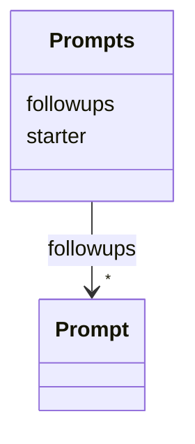

---
search:
  boost: 10.0
---

# Class: Prompts 


_Collection of prompt content for a task._


<div data-search-exclude markdown="1">


URI: [aj:class/Prompts](https://github.com/jeffposey/agentjobs/schema/v1/class/Prompts)





<!-- no inheritance hierarchy -->

## Slots

| Name | Cardinality and Range | Description | Inheritance |
| ---  | --- | --- | --- |
| [starter](../slots/starter.md) | 1 <br/> [String](../types/String.md) | Primary starter prompt content | direct |
| [followups](../slots/followups.md) | * <br/> [Prompt](../classes/Prompt.md) | Subsequent prompts appended during task progression | direct |


## Usages

| used by | used in | type | used |
| ---  | --- | --- | --- |
| [Task](../classes/Task.md) | [prompts](../slots/prompts.md) | range | [Prompts](../classes/Prompts.md) |


## Identifier and Mapping Information


### Schema Source


* from schema: https://github.com/jeffposey/agentjobs/schema/v1


## Mappings

| Mapping Type | Mapped Value |
| ---  | ---  |
| self | aj:Prompts |
| native | aj:Prompts |


## LinkML Source

<!-- TODO: investigate https://stackoverflow.com/questions/37606292/how-to-create-tabbed-code-blocks-in-mkdocs-or-sphinx -->

### Direct

<details>
```yaml
name: Prompts
description: Collection of prompt content for a task.
from_schema: https://github.com/jeffposey/agentjobs/schema/v1
attributes:
  starter:
    name: starter
    description: Primary starter prompt content.
    from_schema: https://github.com/jeffposey/agentjobs/schema/v1
    rank: 1000
    domain_of:
    - Prompts
    required: true
  followups:
    name: followups
    description: Subsequent prompts appended during task progression. A third append-only
      authored list, alongside status_updates and comments.
    from_schema: https://github.com/jeffposey/agentjobs/schema/v1
    rank: 1000
    domain_of:
    - Prompts
    range: Prompt
    multivalued: true
    inlined_as_list: true

```
</details>

### Induced

<details>
```yaml
name: Prompts
description: Collection of prompt content for a task.
from_schema: https://github.com/jeffposey/agentjobs/schema/v1
attributes:
  starter:
    name: starter
    description: Primary starter prompt content.
    from_schema: https://github.com/jeffposey/agentjobs/schema/v1
    rank: 1000
    owner: Prompts
    domain_of:
    - Prompts
    range: string
    required: true
  followups:
    name: followups
    description: Subsequent prompts appended during task progression. A third append-only
      authored list, alongside status_updates and comments.
    from_schema: https://github.com/jeffposey/agentjobs/schema/v1
    rank: 1000
    owner: Prompts
    domain_of:
    - Prompts
    range: Prompt
    multivalued: true
    inlined: true
    inlined_as_list: true

```
</details></div>