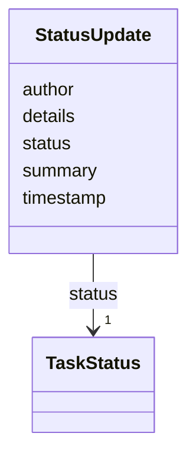

---
search:
  boost: 10.0
---

# Class: StatusUpdate 


_Chronological status update authored during task execution._


<div data-search-exclude markdown="1">


URI: [aj:class/StatusUpdate](https://github.com/jeffposey/agentjobs/schema/v1/class/StatusUpdate)





<!-- no inheritance hierarchy -->

## Slots

| Name | Cardinality and Range | Description | Inheritance |
| ---  | --- | --- | --- |
| [timestamp](../slots/timestamp.md) | 1 <br/> [Datetime](../types/Datetime.md) | Timestamp when the status update was recorded | direct |
| [author](../slots/author.md) | 1 <br/> [String](../types/String.md) | Author of the update (agent or collaborator) | direct |
| [status](../slots/status.md) | 1 <br/> [TaskStatus](../enums/TaskStatus.md) | Workflow status the task transitioned to | direct |
| [summary](../slots/summary.md) | 1 <br/> [String](../types/String.md) | Short summary of the update | direct |
| [details](../slots/details.md) | 0..1 <br/> [String](../types/String.md) | Expanded detail for the status update | direct |


## Usages

| used by | used in | type | used |
| ---  | --- | --- | --- |
| [Task](../classes/Task.md) | [status_updates](../slots/status_updates.md) | range | [StatusUpdate](../classes/StatusUpdate.md) |


## Identifier and Mapping Information


### Schema Source


* from schema: https://github.com/jeffposey/agentjobs/schema/v1


## Mappings

| Mapping Type | Mapped Value |
| ---  | ---  |
| self | aj:StatusUpdate |
| native | aj:StatusUpdate |


## LinkML Source

<!-- TODO: investigate https://stackoverflow.com/questions/37606292/how-to-create-tabbed-code-blocks-in-mkdocs-or-sphinx -->

### Direct

<details>
```yaml
name: StatusUpdate
description: Chronological status update authored during task execution.
from_schema: https://github.com/jeffposey/agentjobs/schema/v1
attributes:
  timestamp:
    name: timestamp
    description: Timestamp when the status update was recorded.
    from_schema: https://github.com/jeffposey/agentjobs/schema/v1
    domain_of:
    - Prompt
    - StatusUpdate
    range: datetime
    required: true
  author:
    name: author
    description: Author of the update (agent or collaborator). Free text.
    from_schema: https://github.com/jeffposey/agentjobs/schema/v1
    domain_of:
    - Prompt
    - StatusUpdate
    - Comment
    required: true
  status:
    name: status
    description: Workflow status the task transitioned to.
    from_schema: https://github.com/jeffposey/agentjobs/schema/v1
    domain_of:
    - Task
    - Phase
    - SuccessCriterion
    - StatusUpdate
    - Deliverable
    - Dependency
    - Issue
    - Branch
    range: TaskStatus
    required: true
  summary:
    name: summary
    description: Short summary of the update.
    from_schema: https://github.com/jeffposey/agentjobs/schema/v1
    rank: 1000
    domain_of:
    - StatusUpdate
    required: true
  details:
    name: details
    description: Expanded detail for the status update.
    from_schema: https://github.com/jeffposey/agentjobs/schema/v1
    rank: 1000
    domain_of:
    - StatusUpdate

```
</details>

### Induced

<details>
```yaml
name: StatusUpdate
description: Chronological status update authored during task execution.
from_schema: https://github.com/jeffposey/agentjobs/schema/v1
attributes:
  timestamp:
    name: timestamp
    description: Timestamp when the status update was recorded.
    from_schema: https://github.com/jeffposey/agentjobs/schema/v1
    owner: StatusUpdate
    domain_of:
    - Prompt
    - StatusUpdate
    range: datetime
    required: true
  author:
    name: author
    description: Author of the update (agent or collaborator). Free text.
    from_schema: https://github.com/jeffposey/agentjobs/schema/v1
    owner: StatusUpdate
    domain_of:
    - Prompt
    - StatusUpdate
    - Comment
    range: string
    required: true
  status:
    name: status
    description: Workflow status the task transitioned to.
    from_schema: https://github.com/jeffposey/agentjobs/schema/v1
    owner: StatusUpdate
    domain_of:
    - Task
    - Phase
    - SuccessCriterion
    - StatusUpdate
    - Deliverable
    - Dependency
    - Issue
    - Branch
    range: TaskStatus
    required: true
  summary:
    name: summary
    description: Short summary of the update.
    from_schema: https://github.com/jeffposey/agentjobs/schema/v1
    rank: 1000
    owner: StatusUpdate
    domain_of:
    - StatusUpdate
    range: string
    required: true
  details:
    name: details
    description: Expanded detail for the status update.
    from_schema: https://github.com/jeffposey/agentjobs/schema/v1
    rank: 1000
    owner: StatusUpdate
    domain_of:
    - StatusUpdate
    range: string

```
</details></div>