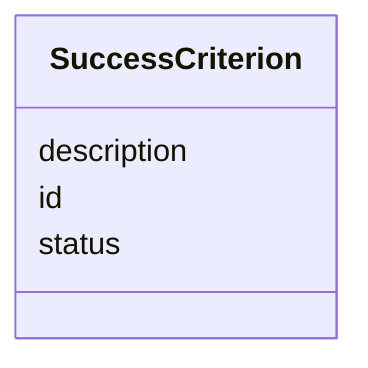

---
search:
  boost: 10.0
---

# Class: SuccessCriterion 


_Success criterion tracked per task._


<div data-search-exclude markdown="1">


URI: [aj:class/SuccessCriterion](https://github.com/jeffposey/agentjobs/schema/v1/class/SuccessCriterion)





<!-- no inheritance hierarchy -->

## Slots

| Name | Cardinality and Range | Description | Inheritance |
| ---  | --- | --- | --- |
| [id](../slots/id.md) | 1 <br/> [String](../types/String.md) | Unique identifier for the success criterion | direct |
| [description](../slots/description.md) | 1 <br/> [String](../types/String.md) | Description of the success criterion | direct |
| [status](../slots/status.md) | 0..1 <br/> [String](../types/String.md) | Completion state | direct |


## Usages

| used by | used in | type | used |
| ---  | --- | --- | --- |
| [Task](../classes/Task.md) | [success_criteria](../slots/success_criteria.md) | range | [SuccessCriterion](../classes/SuccessCriterion.md) |


## Identifier and Mapping Information


### Schema Source


* from schema: https://github.com/jeffposey/agentjobs/schema/v1


## Mappings

| Mapping Type | Mapped Value |
| ---  | ---  |
| self | aj:SuccessCriterion |
| native | aj:SuccessCriterion |


## LinkML Source

<!-- TODO: investigate https://stackoverflow.com/questions/37606292/how-to-create-tabbed-code-blocks-in-mkdocs-or-sphinx -->

### Direct

<details>
```yaml
name: SuccessCriterion
description: Success criterion tracked per task.
from_schema: https://github.com/jeffposey/agentjobs/schema/v1
attributes:
  id:
    name: id
    description: Unique identifier for the success criterion.
    from_schema: https://github.com/jeffposey/agentjobs/schema/v1
    domain_of:
    - Task
    - Phase
    - SuccessCriterion
    - Comment
    - Issue
    - Webhook
    required: true
  description:
    name: description
    description: Description of the success criterion.
    from_schema: https://github.com/jeffposey/agentjobs/schema/v1
    domain_of:
    - Task
    - SuccessCriterion
    - Deliverable
    required: true
  status:
    name: status
    description: Completion state. Enforced by a field_validator against pending |
      in_progress | completed | failed, but typed as a bare str, so the vocabulary
      is invisible to any schema consumer.
    from_schema: https://github.com/jeffposey/agentjobs/schema/v1
    ifabsent: string(pending)
    domain_of:
    - Task
    - Phase
    - SuccessCriterion
    - StatusUpdate
    - Deliverable
    - Dependency
    - Issue
    - Branch

```
</details>

### Induced

<details>
```yaml
name: SuccessCriterion
description: Success criterion tracked per task.
from_schema: https://github.com/jeffposey/agentjobs/schema/v1
attributes:
  id:
    name: id
    description: Unique identifier for the success criterion.
    from_schema: https://github.com/jeffposey/agentjobs/schema/v1
    owner: SuccessCriterion
    domain_of:
    - Task
    - Phase
    - SuccessCriterion
    - Comment
    - Issue
    - Webhook
    range: string
    required: true
  description:
    name: description
    description: Description of the success criterion.
    from_schema: https://github.com/jeffposey/agentjobs/schema/v1
    owner: SuccessCriterion
    domain_of:
    - Task
    - SuccessCriterion
    - Deliverable
    range: string
    required: true
  status:
    name: status
    description: Completion state. Enforced by a field_validator against pending |
      in_progress | completed | failed, but typed as a bare str, so the vocabulary
      is invisible to any schema consumer.
    from_schema: https://github.com/jeffposey/agentjobs/schema/v1
    ifabsent: string(pending)
    owner: SuccessCriterion
    domain_of:
    - Task
    - Phase
    - SuccessCriterion
    - StatusUpdate
    - Deliverable
    - Dependency
    - Issue
    - Branch
    range: string

```
</details></div>