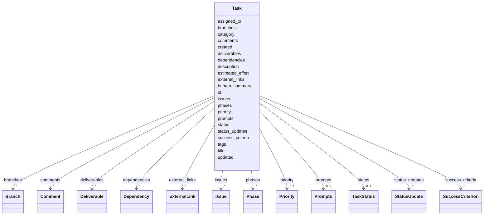

---
search:
  boost: 10.0
---

# Class: Task 


_Primary task representation. One YAML file per task, in git._


<div data-search-exclude markdown="1">


URI: [aj:class/Task](https://github.com/jeffposey/agentjobs/schema/v1/class/Task)





<!-- no inheritance hierarchy -->

## Class Properties

| Property | Value |
| --- | --- |
| Tree Root | Yes |


## Slots

| Name | Cardinality and Range | Description | Inheritance |
| ---  | --- | --- | --- |
| [id](../slots/id.md) | 1 <br/> [String](../types/String.md) | Unique task identifier (e | direct |
| [title](../slots/title.md) | 1 <br/> [String](../types/String.md) | Task title summarising the work | direct |
| [created](../slots/created.md) | 1 <br/> [Datetime](../types/Datetime.md) | Creation timestamp | direct |
| [updated](../slots/updated.md) | 1 <br/> [Datetime](../types/Datetime.md) | Last update timestamp | direct |
| [status](../slots/status.md) | 0..1 <br/> [TaskStatus](../enums/TaskStatus.md) | Current workflow status | direct |
| [priority](../slots/priority.md) | 0..1 <br/> [Priority](../enums/Priority.md) | Relative priority weighting | direct |
| [category](../slots/category.md) | 1 <br/> [String](../types/String.md) | Task category for filtering | direct |
| [assigned_to](../slots/assigned_to.md) | 0..1 <br/> [String](../types/String.md) | Documented as "currently assigned", used in practice as a static authoring-ti... | direct |
| [estimated_effort](../slots/estimated_effort.md) | 0..1 <br/> [String](../types/String.md) | Estimated effort (time or complexity) | direct |
| [human_summary](../slots/human_summary.md) | 0..1 <br/> [String](../types/String.md) | Concise 1-2 sentence summary for human reviewers | direct |
| [description](../slots/description.md) | 1 <br/> [String](../types/String.md) | Markdown description | direct |
| [phases](../slots/phases.md) | * <br/> [Phase](../classes/Phase.md) | Sub-units inside one task | direct |
| [success_criteria](../slots/success_criteria.md) | * <br/> [SuccessCriterion](../classes/SuccessCriterion.md) | Success criteria checklist | direct |
| [prompts](../slots/prompts.md) | 0..1 <br/> [Prompts](../classes/Prompts.md) | Prompt collection used by collaborating agents | direct |
| [status_updates](../slots/status_updates.md) | * <br/> [StatusUpdate](../classes/StatusUpdate.md) | Chronological status updates | direct |
| [comments](../slots/comments.md) | * <br/> [Comment](../classes/Comment.md) | Comments and feedback | direct |
| [deliverables](../slots/deliverables.md) | * <br/> [Deliverable](../classes/Deliverable.md) | Deliverables associated with task completion | direct |
| [dependencies](../slots/dependencies.md) | * <br/> [Dependency](../classes/Dependency.md) | Task dependencies and relationships | direct |
| [external_links](../slots/external_links.md) | * <br/> [ExternalLink](../classes/ExternalLink.md) | External references for the task | direct |
| [issues](../slots/issues.md) | * <br/> [Issue](../classes/Issue.md) | Issues encountered while executing the task | direct |
| [tags](../slots/tags.md) | * <br/> [String](../types/String.md) | Tag metadata for filtering and search | direct |
| [branches](../slots/branches.md) | * <br/> [Branch](../classes/Branch.md) | Branch metadata associated with the task | direct |


## Identifier and Mapping Information


### Schema Source


* from schema: https://github.com/jeffposey/agentjobs/schema/v1


## Mappings

| Mapping Type | Mapped Value |
| ---  | ---  |
| self | aj:Task |
| native | aj:Task |


## LinkML Source

<!-- TODO: investigate https://stackoverflow.com/questions/37606292/how-to-create-tabbed-code-blocks-in-mkdocs-or-sphinx -->

### Direct

<details>
```yaml
name: Task
description: Primary task representation. One YAML file per task, in git.
from_schema: https://github.com/jeffposey/agentjobs/schema/v1
attributes:
  id:
    name: id
    description: Unique task identifier (e.g. task-001).
    from_schema: https://github.com/jeffposey/agentjobs/schema/v1
    rank: 1000
    identifier: true
    domain_of:
    - Task
    - Phase
    - SuccessCriterion
    - Comment
    - Issue
    - Webhook
    required: true
  title:
    name: title
    description: Task title summarising the work.
    from_schema: https://github.com/jeffposey/agentjobs/schema/v1
    rank: 1000
    domain_of:
    - Task
    - Phase
    - ExternalLink
    - Issue
    required: true
  created:
    name: created
    description: Creation timestamp.
    from_schema: https://github.com/jeffposey/agentjobs/schema/v1
    rank: 1000
    domain_of:
    - Task
    - Comment
    - Webhook
    range: datetime
    required: true
  updated:
    name: updated
    description: Last update timestamp.
    from_schema: https://github.com/jeffposey/agentjobs/schema/v1
    rank: 1000
    domain_of:
    - Task
    - Comment
    range: datetime
    required: true
  status:
    name: status
    description: Current workflow status.
    from_schema: https://github.com/jeffposey/agentjobs/schema/v1
    rank: 1000
    ifabsent: string(draft)
    domain_of:
    - Task
    - Phase
    - SuccessCriterion
    - StatusUpdate
    - Deliverable
    - Dependency
    - Issue
    - Branch
    range: TaskStatus
  priority:
    name: priority
    description: Relative priority weighting.
    from_schema: https://github.com/jeffposey/agentjobs/schema/v1
    rank: 1000
    ifabsent: string(medium)
    domain_of:
    - Task
    range: Priority
  category:
    name: category
    description: Task category for filtering. Free text -- no vocabulary, no validation
      against config.
    from_schema: https://github.com/jeffposey/agentjobs/schema/v1
    rank: 1000
    domain_of:
    - Task
    required: true
  assigned_to:
    name: assigned_to
    description: Documented as "currently assigned", used in practice as a static
      authoring-time label. Ownership and eligibility conflated.
    from_schema: https://github.com/jeffposey/agentjobs/schema/v1
    rank: 1000
    domain_of:
    - Task
  estimated_effort:
    name: estimated_effort
    description: Estimated effort (time or complexity). Free text.
    from_schema: https://github.com/jeffposey/agentjobs/schema/v1
    rank: 1000
    domain_of:
    - Task
  human_summary:
    name: human_summary
    description: Concise 1-2 sentence summary for human reviewers. Splits the audience
      by length rather than by content, so it duplicates the description's opening.
    from_schema: https://github.com/jeffposey/agentjobs/schema/v1
    rank: 1000
    domain_of:
    - Task
  description:
    name: description
    description: Markdown description. One undifferentiated blob carrying intent,
      spec, constraints, non-goals and context pointers with no structure.
    from_schema: https://github.com/jeffposey/agentjobs/schema/v1
    rank: 1000
    domain_of:
    - Task
    - SuccessCriterion
    - Deliverable
    required: true
  phases:
    name: phases
    description: Sub-units inside one task. Not claimable, no prompts, no comments.
      Overlaps with real sub-tasks; deleted in v2 (D1).
    from_schema: https://github.com/jeffposey/agentjobs/schema/v1
    rank: 1000
    domain_of:
    - Task
    range: Phase
    multivalued: true
    inlined_as_list: true
  success_criteria:
    name: success_criteria
    description: Success criteria checklist.
    from_schema: https://github.com/jeffposey/agentjobs/schema/v1
    rank: 1000
    domain_of:
    - Task
    range: SuccessCriterion
    multivalued: true
    inlined_as_list: true
  prompts:
    name: prompts
    description: Prompt collection used by collaborating agents. Deleted in v2 (D1)
      -- the starter almost always restates the description.
    from_schema: https://github.com/jeffposey/agentjobs/schema/v1
    rank: 1000
    domain_of:
    - Task
    range: Prompts
    inlined: true
  status_updates:
    name: status_updates
    description: Chronological status updates. Append-only, timestamped, authored
      -- the same shape as comments, with an implied but unenforced role split.
    from_schema: https://github.com/jeffposey/agentjobs/schema/v1
    rank: 1000
    domain_of:
    - Task
    range: StatusUpdate
    multivalued: true
    inlined_as_list: true
  comments:
    name: comments
    description: Comments and feedback. Second append-only authored log; merged with
      status_updates into one typed log in v2.
    from_schema: https://github.com/jeffposey/agentjobs/schema/v1
    rank: 1000
    domain_of:
    - Task
    range: Comment
    multivalued: true
    inlined_as_list: true
  deliverables:
    name: deliverables
    description: Deliverables associated with task completion.
    from_schema: https://github.com/jeffposey/agentjobs/schema/v1
    rank: 1000
    domain_of:
    - Task
    range: Deliverable
    multivalued: true
    inlined_as_list: true
  dependencies:
    name: dependencies
    description: Task dependencies and relationships.
    from_schema: https://github.com/jeffposey/agentjobs/schema/v1
    rank: 1000
    domain_of:
    - Task
    range: Dependency
    multivalued: true
    inlined_as_list: true
  external_links:
    name: external_links
    description: External references for the task.
    from_schema: https://github.com/jeffposey/agentjobs/schema/v1
    rank: 1000
    domain_of:
    - Task
    range: ExternalLink
    multivalued: true
    inlined_as_list: true
  issues:
    name: issues
    description: Issues encountered while executing the task. Empty in every file
      in the corpus; deleted in v2 (D1).
    from_schema: https://github.com/jeffposey/agentjobs/schema/v1
    rank: 1000
    domain_of:
    - Task
    range: Issue
    multivalued: true
    inlined_as_list: true
  tags:
    name: tags
    description: Tag metadata for filtering and search. No vocabulary enforced.
    from_schema: https://github.com/jeffposey/agentjobs/schema/v1
    rank: 1000
    domain_of:
    - Task
    multivalued: true
  branches:
    name: branches
    description: Branch metadata associated with the task.
    from_schema: https://github.com/jeffposey/agentjobs/schema/v1
    rank: 1000
    domain_of:
    - Task
    range: Branch
    multivalued: true
    inlined_as_list: true
tree_root: true

```
</details>

### Induced

<details>
```yaml
name: Task
description: Primary task representation. One YAML file per task, in git.
from_schema: https://github.com/jeffposey/agentjobs/schema/v1
attributes:
  id:
    name: id
    description: Unique task identifier (e.g. task-001).
    from_schema: https://github.com/jeffposey/agentjobs/schema/v1
    rank: 1000
    identifier: true
    owner: Task
    domain_of:
    - Task
    - Phase
    - SuccessCriterion
    - Comment
    - Issue
    - Webhook
    range: string
    required: true
  title:
    name: title
    description: Task title summarising the work.
    from_schema: https://github.com/jeffposey/agentjobs/schema/v1
    rank: 1000
    owner: Task
    domain_of:
    - Task
    - Phase
    - ExternalLink
    - Issue
    range: string
    required: true
  created:
    name: created
    description: Creation timestamp.
    from_schema: https://github.com/jeffposey/agentjobs/schema/v1
    rank: 1000
    owner: Task
    domain_of:
    - Task
    - Comment
    - Webhook
    range: datetime
    required: true
  updated:
    name: updated
    description: Last update timestamp.
    from_schema: https://github.com/jeffposey/agentjobs/schema/v1
    rank: 1000
    owner: Task
    domain_of:
    - Task
    - Comment
    range: datetime
    required: true
  status:
    name: status
    description: Current workflow status.
    from_schema: https://github.com/jeffposey/agentjobs/schema/v1
    rank: 1000
    ifabsent: string(draft)
    owner: Task
    domain_of:
    - Task
    - Phase
    - SuccessCriterion
    - StatusUpdate
    - Deliverable
    - Dependency
    - Issue
    - Branch
    range: TaskStatus
  priority:
    name: priority
    description: Relative priority weighting.
    from_schema: https://github.com/jeffposey/agentjobs/schema/v1
    rank: 1000
    ifabsent: string(medium)
    owner: Task
    domain_of:
    - Task
    range: Priority
  category:
    name: category
    description: Task category for filtering. Free text -- no vocabulary, no validation
      against config.
    from_schema: https://github.com/jeffposey/agentjobs/schema/v1
    rank: 1000
    owner: Task
    domain_of:
    - Task
    range: string
    required: true
  assigned_to:
    name: assigned_to
    description: Documented as "currently assigned", used in practice as a static
      authoring-time label. Ownership and eligibility conflated.
    from_schema: https://github.com/jeffposey/agentjobs/schema/v1
    rank: 1000
    owner: Task
    domain_of:
    - Task
    range: string
  estimated_effort:
    name: estimated_effort
    description: Estimated effort (time or complexity). Free text.
    from_schema: https://github.com/jeffposey/agentjobs/schema/v1
    rank: 1000
    owner: Task
    domain_of:
    - Task
    range: string
  human_summary:
    name: human_summary
    description: Concise 1-2 sentence summary for human reviewers. Splits the audience
      by length rather than by content, so it duplicates the description's opening.
    from_schema: https://github.com/jeffposey/agentjobs/schema/v1
    rank: 1000
    owner: Task
    domain_of:
    - Task
    range: string
  description:
    name: description
    description: Markdown description. One undifferentiated blob carrying intent,
      spec, constraints, non-goals and context pointers with no structure.
    from_schema: https://github.com/jeffposey/agentjobs/schema/v1
    rank: 1000
    owner: Task
    domain_of:
    - Task
    - SuccessCriterion
    - Deliverable
    range: string
    required: true
  phases:
    name: phases
    description: Sub-units inside one task. Not claimable, no prompts, no comments.
      Overlaps with real sub-tasks; deleted in v2 (D1).
    from_schema: https://github.com/jeffposey/agentjobs/schema/v1
    rank: 1000
    owner: Task
    domain_of:
    - Task
    range: Phase
    multivalued: true
    inlined: true
    inlined_as_list: true
  success_criteria:
    name: success_criteria
    description: Success criteria checklist.
    from_schema: https://github.com/jeffposey/agentjobs/schema/v1
    rank: 1000
    owner: Task
    domain_of:
    - Task
    range: SuccessCriterion
    multivalued: true
    inlined: true
    inlined_as_list: true
  prompts:
    name: prompts
    description: Prompt collection used by collaborating agents. Deleted in v2 (D1)
      -- the starter almost always restates the description.
    from_schema: https://github.com/jeffposey/agentjobs/schema/v1
    rank: 1000
    owner: Task
    domain_of:
    - Task
    range: Prompts
    inlined: true
  status_updates:
    name: status_updates
    description: Chronological status updates. Append-only, timestamped, authored
      -- the same shape as comments, with an implied but unenforced role split.
    from_schema: https://github.com/jeffposey/agentjobs/schema/v1
    rank: 1000
    owner: Task
    domain_of:
    - Task
    range: StatusUpdate
    multivalued: true
    inlined: true
    inlined_as_list: true
  comments:
    name: comments
    description: Comments and feedback. Second append-only authored log; merged with
      status_updates into one typed log in v2.
    from_schema: https://github.com/jeffposey/agentjobs/schema/v1
    rank: 1000
    owner: Task
    domain_of:
    - Task
    range: Comment
    multivalued: true
    inlined: true
    inlined_as_list: true
  deliverables:
    name: deliverables
    description: Deliverables associated with task completion.
    from_schema: https://github.com/jeffposey/agentjobs/schema/v1
    rank: 1000
    owner: Task
    domain_of:
    - Task
    range: Deliverable
    multivalued: true
    inlined: true
    inlined_as_list: true
  dependencies:
    name: dependencies
    description: Task dependencies and relationships.
    from_schema: https://github.com/jeffposey/agentjobs/schema/v1
    rank: 1000
    owner: Task
    domain_of:
    - Task
    range: Dependency
    multivalued: true
    inlined: true
    inlined_as_list: true
  external_links:
    name: external_links
    description: External references for the task.
    from_schema: https://github.com/jeffposey/agentjobs/schema/v1
    rank: 1000
    owner: Task
    domain_of:
    - Task
    range: ExternalLink
    multivalued: true
    inlined: true
    inlined_as_list: true
  issues:
    name: issues
    description: Issues encountered while executing the task. Empty in every file
      in the corpus; deleted in v2 (D1).
    from_schema: https://github.com/jeffposey/agentjobs/schema/v1
    rank: 1000
    owner: Task
    domain_of:
    - Task
    range: Issue
    multivalued: true
    inlined: true
    inlined_as_list: true
  tags:
    name: tags
    description: Tag metadata for filtering and search. No vocabulary enforced.
    from_schema: https://github.com/jeffposey/agentjobs/schema/v1
    rank: 1000
    owner: Task
    domain_of:
    - Task
    range: string
    multivalued: true
  branches:
    name: branches
    description: Branch metadata associated with the task.
    from_schema: https://github.com/jeffposey/agentjobs/schema/v1
    rank: 1000
    owner: Task
    domain_of:
    - Task
    range: Branch
    multivalued: true
    inlined: true
    inlined_as_list: true
tree_root: true

```
</details></div>