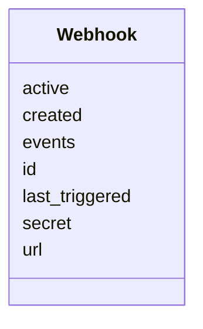

---
search:
  boost: 10.0
---

# Class: Webhook 


_Webhook configuration for task event notifications. Stored outside task files; included here for completeness of the v1 model surface._


<div data-search-exclude markdown="1">


URI: [aj:class/Webhook](https://github.com/jeffposey/agentjobs/schema/v1/class/Webhook)





<!-- no inheritance hierarchy -->

## Slots

| Name | Cardinality and Range | Description | Inheritance |
| ---  | --- | --- | --- |
| [id](../slots/id.md) | 1 <br/> [String](../types/String.md) | Unique webhook identifier | direct |
| [url](../slots/url.md) | 1 <br/> [Uri](../types/Uri.md) | Target URL for webhook delivery | direct |
| [events](../slots/events.md) | 1..* <br/> [String](../types/String.md) | Events that trigger this webhook | direct |
| [secret](../slots/secret.md) | 1 <br/> [String](../types/String.md) | Secret for HMAC signature verification | direct |
| [active](../slots/active.md) | 0..1 <br/> [Boolean](../types/Boolean.md) | Whether this webhook is active | direct |
| [created](../slots/created.md) | 1 <br/> [Datetime](../types/Datetime.md) | When the webhook was created | direct |
| [last_triggered](../slots/last_triggered.md) | 0..1 <br/> [Datetime](../types/Datetime.md) | Last successful trigger | direct |


## Identifier and Mapping Information


### Schema Source


* from schema: https://github.com/jeffposey/agentjobs/schema/v1


## Mappings

| Mapping Type | Mapped Value |
| ---  | ---  |
| self | aj:Webhook |
| native | aj:Webhook |


## LinkML Source

<!-- TODO: investigate https://stackoverflow.com/questions/37606292/how-to-create-tabbed-code-blocks-in-mkdocs-or-sphinx -->

### Direct

<details>
```yaml
name: Webhook
description: Webhook configuration for task event notifications. Stored outside task
  files; included here for completeness of the v1 model surface.
from_schema: https://github.com/jeffposey/agentjobs/schema/v1
attributes:
  id:
    name: id
    description: Unique webhook identifier.
    from_schema: https://github.com/jeffposey/agentjobs/schema/v1
    domain_of:
    - Task
    - Phase
    - SuccessCriterion
    - Comment
    - Issue
    - Webhook
    required: true
  url:
    name: url
    description: Target URL for webhook delivery. The one genuinely validated URL.
    from_schema: https://github.com/jeffposey/agentjobs/schema/v1
    domain_of:
    - ExternalLink
    - Webhook
    range: uri
    required: true
  events:
    name: events
    description: Events that trigger this webhook. Free-text strings against no event
      vocabulary.
    from_schema: https://github.com/jeffposey/agentjobs/schema/v1
    rank: 1000
    domain_of:
    - Webhook
    required: true
    multivalued: true
  secret:
    name: secret
    description: Secret for HMAC signature verification.
    from_schema: https://github.com/jeffposey/agentjobs/schema/v1
    rank: 1000
    domain_of:
    - Webhook
    required: true
  active:
    name: active
    description: Whether this webhook is active.
    from_schema: https://github.com/jeffposey/agentjobs/schema/v1
    rank: 1000
    ifabsent: 'true'
    domain_of:
    - Webhook
    range: boolean
  created:
    name: created
    description: When the webhook was created.
    from_schema: https://github.com/jeffposey/agentjobs/schema/v1
    domain_of:
    - Task
    - Comment
    - Webhook
    range: datetime
    required: true
  last_triggered:
    name: last_triggered
    description: Last successful trigger. Written by record_trigger(), which raises
      NameError for the same missing timezone import (see task-047).
    from_schema: https://github.com/jeffposey/agentjobs/schema/v1
    rank: 1000
    domain_of:
    - Webhook
    range: datetime

```
</details>

### Induced

<details>
```yaml
name: Webhook
description: Webhook configuration for task event notifications. Stored outside task
  files; included here for completeness of the v1 model surface.
from_schema: https://github.com/jeffposey/agentjobs/schema/v1
attributes:
  id:
    name: id
    description: Unique webhook identifier.
    from_schema: https://github.com/jeffposey/agentjobs/schema/v1
    owner: Webhook
    domain_of:
    - Task
    - Phase
    - SuccessCriterion
    - Comment
    - Issue
    - Webhook
    range: string
    required: true
  url:
    name: url
    description: Target URL for webhook delivery. The one genuinely validated URL.
    from_schema: https://github.com/jeffposey/agentjobs/schema/v1
    owner: Webhook
    domain_of:
    - ExternalLink
    - Webhook
    range: uri
    required: true
  events:
    name: events
    description: Events that trigger this webhook. Free-text strings against no event
      vocabulary.
    from_schema: https://github.com/jeffposey/agentjobs/schema/v1
    rank: 1000
    owner: Webhook
    domain_of:
    - Webhook
    range: string
    required: true
    multivalued: true
  secret:
    name: secret
    description: Secret for HMAC signature verification.
    from_schema: https://github.com/jeffposey/agentjobs/schema/v1
    rank: 1000
    owner: Webhook
    domain_of:
    - Webhook
    range: string
    required: true
  active:
    name: active
    description: Whether this webhook is active.
    from_schema: https://github.com/jeffposey/agentjobs/schema/v1
    rank: 1000
    ifabsent: 'true'
    owner: Webhook
    domain_of:
    - Webhook
    range: boolean
  created:
    name: created
    description: When the webhook was created.
    from_schema: https://github.com/jeffposey/agentjobs/schema/v1
    owner: Webhook
    domain_of:
    - Task
    - Comment
    - Webhook
    range: datetime
    required: true
  last_triggered:
    name: last_triggered
    description: Last successful trigger. Written by record_trigger(), which raises
      NameError for the same missing timezone import (see task-047).
    from_schema: https://github.com/jeffposey/agentjobs/schema/v1
    rank: 1000
    owner: Webhook
    domain_of:
    - Webhook
    range: datetime

```
</details></div>