# Schema v2 -- entity diagram

Generated by `gen-erdiagram` from `schema/agentjobs-v2.yaml`, rendered to SVG by `mmdc`.
Do not hand-edit -- run `scripts/regen-schema-docs.sh`.

**[Open the full-size SVG](agentjobs-v2.er.svg)** to pan and zoom natively
in your browser. Or click the diagram below to zoom it in place.

[](agentjobs-v2.er.svg)

??? note "Mermaid source"

    ```mermaid
    erDiagram
    AcceptanceCriterion {
        string id  
        AcceptanceStatus status  
        string text  
        string verify  
    }
    Actor {
        string id  
        ActorKind kind  
    }
    AnyValue {
    
    }
    Assignment {
        stringList eligible  
    }
    Attachment {
        string label  
        string media_type  
        string path  
        string sha256  
        integer size_bytes  
    }
    Branch {
        string name  
        datetime merged_at  
        BranchStatus status  
    }
    ContextPointer {
        string path  
        string why  
    }
    Deliverable {
        string note  
        string path  
        DeliverableStatus status  
    }
    Dependency {
        string note  
        string task  
        DependencyType type  
    }
    Link {
        LinkRel rel  
        string title  
        uri url  
    }
    LogEntry {
        integer id  
        string body  
        integer re  
        datetime ts  
        LogEntryType type  
    }
    Spec {
        string description  
        string constraints  
        string intent  
        string out_of_scope  
        string summary  
    }
    Task {
        string id  
        boolean archived  
        Ball ball  
        string ball_prompt  
        BallReason ball_reason  
        string category  
        datetime created  
        string effort  
        Lifecycle lifecycle  
        Outcome outcome  
        string parent  
        Priority priority  
        integer queue_position  
        integer schema  
        stringList tags  
        string title  
        datetime updated  
    }
    
    Assignment ||--|o Actor : "owner"
    LogEntry ||--|o AnyValue : "data"
    LogEntry ||--|| Actor : "actor"
    LogEntry ||--}o Attachment : "attachments"
    Spec ||--}o ContextPointer : "context"
    Task ||--|o Assignment : "assignment"
    Task ||--|| Spec : "spec"
    Task ||--}o AcceptanceCriterion : "acceptance"
    Task ||--}o Branch : "branches"
    Task ||--}o Deliverable : "deliverables"
    Task ||--}o Dependency : "dependencies"
    Task ||--}o Link : "links"
    Task ||--}o LogEntry : "log"
    
    ```
    
