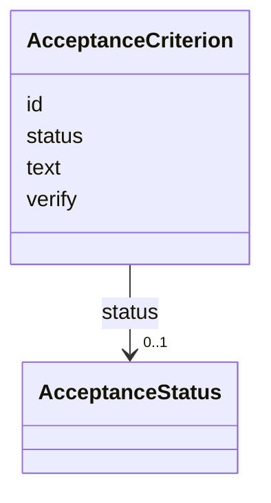

---
search:
  boost: 10.0
---

# Class: AcceptanceCriterion 


_One verifiable condition for done. Replaces SuccessCriterion; adds an optional machine-checkable hint._


<div data-search-exclude markdown="1">


URI: [aj:class/AcceptanceCriterion](https://github.com/jeffposey/agentjobs/schema/v2/class/AcceptanceCriterion)





<!-- no inheritance hierarchy -->

## Slots

| Name | Cardinality and Range | Description | Inheritance |
| ---  | --- | --- | --- |
| [id](../slots/id.md) | 1 <br/> [String](../types/String.md) | Criterion identifier, scoped to the task (e | direct |
| [text](../slots/text.md) | 1 <br/> [String](../types/String.md) | The condition, stated so it can be judged true or false | direct |
| [verify](../slots/verify.md) | 0..1 <br/> [String](../types/String.md) | Optional machine-checkable hint -- a command that demonstrates the criterion | direct |
| [status](../slots/status.md) | 0..1 <br/> [AcceptanceStatus](../enums/AcceptanceStatus.md) |  | direct |


## Usages

| used by | used in | type | used |
| ---  | --- | --- | --- |
| [Task](../classes/Task.md) | [acceptance](../slots/acceptance.md) | range | [AcceptanceCriterion](../classes/AcceptanceCriterion.md) |


## Identifier and Mapping Information


### Schema Source


* from schema: https://github.com/jeffposey/agentjobs/schema/v2


## Mappings

| Mapping Type | Mapped Value |
| ---  | ---  |
| self | aj:AcceptanceCriterion |
| native | aj:AcceptanceCriterion |


## LinkML Source

<!-- TODO: investigate https://stackoverflow.com/questions/37606292/how-to-create-tabbed-code-blocks-in-mkdocs-or-sphinx -->

### Direct

<details>
```yaml
name: AcceptanceCriterion
description: One verifiable condition for done. Replaces SuccessCriterion; adds an
  optional machine-checkable hint.
from_schema: https://github.com/jeffposey/agentjobs/schema/v2
attributes:
  id:
    name: id
    description: Criterion identifier, scoped to the task (e.g. ac-1).
    from_schema: https://github.com/jeffposey/agentjobs/schema/v2
    domain_of:
    - Task
    - Actor
    - AcceptanceCriterion
    - LogEntry
    required: true
  text:
    name: text
    description: The condition, stated so it can be judged true or false.
    from_schema: https://github.com/jeffposey/agentjobs/schema/v2
    rank: 1000
    domain_of:
    - AcceptanceCriterion
    required: true
  verify:
    name: verify
    description: Optional machine-checkable hint -- a command that demonstrates the
      criterion. Advisory, not executed automatically.
    from_schema: https://github.com/jeffposey/agentjobs/schema/v2
    rank: 1000
    domain_of:
    - AcceptanceCriterion
  status:
    name: status
    from_schema: https://github.com/jeffposey/agentjobs/schema/v2
    rank: 1000
    ifabsent: string(pending)
    domain_of:
    - AcceptanceCriterion
    - Deliverable
    - Branch
    range: AcceptanceStatus

```
</details>

### Induced

<details>
```yaml
name: AcceptanceCriterion
description: One verifiable condition for done. Replaces SuccessCriterion; adds an
  optional machine-checkable hint.
from_schema: https://github.com/jeffposey/agentjobs/schema/v2
attributes:
  id:
    name: id
    description: Criterion identifier, scoped to the task (e.g. ac-1).
    from_schema: https://github.com/jeffposey/agentjobs/schema/v2
    owner: AcceptanceCriterion
    domain_of:
    - Task
    - Actor
    - AcceptanceCriterion
    - LogEntry
    range: string
    required: true
  text:
    name: text
    description: The condition, stated so it can be judged true or false.
    from_schema: https://github.com/jeffposey/agentjobs/schema/v2
    rank: 1000
    owner: AcceptanceCriterion
    domain_of:
    - AcceptanceCriterion
    range: string
    required: true
  verify:
    name: verify
    description: Optional machine-checkable hint -- a command that demonstrates the
      criterion. Advisory, not executed automatically.
    from_schema: https://github.com/jeffposey/agentjobs/schema/v2
    rank: 1000
    owner: AcceptanceCriterion
    domain_of:
    - AcceptanceCriterion
    range: string
  status:
    name: status
    from_schema: https://github.com/jeffposey/agentjobs/schema/v2
    rank: 1000
    ifabsent: string(pending)
    owner: AcceptanceCriterion
    domain_of:
    - AcceptanceCriterion
    - Deliverable
    - Branch
    range: AcceptanceStatus

```
</details></div>