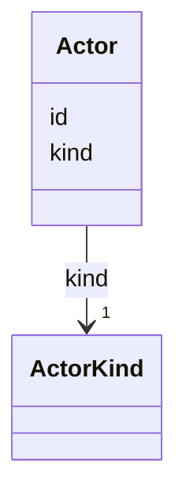

---
search:
  boost: 10.0
---

# Class: Actor 


_A party that can act on tasks. Replaces v1's free-text author string, so "was this an agent or a human" becomes queryable._

_Actors are PROJECT-LEVEL entities defined in config, not per-task data (D4). A task file references an actor by bare id and `kind` is resolved from config, so it cannot drift. This class documents the config entity; inside a task file an actor appears only as its id string._


<div data-search-exclude markdown="1">


URI: [aj:class/Actor](https://github.com/jeffposey/agentjobs/schema/v2/class/Actor)





<!-- no inheritance hierarchy -->

## Slots

| Name | Cardinality and Range | Description | Inheritance |
| ---  | --- | --- | --- |
| [id](../slots/id.md) | 1 <br/> [String](../types/String.md) | Actor identifier, e | direct |
| [kind](../slots/kind.md) | 1 <br/> [ActorKind](../enums/ActorKind.md) | What kind of party this is | direct |


## Usages

| used by | used in | type | used |
| ---  | --- | --- | --- |
| [Assignment](../classes/Assignment.md) | [owner](../slots/owner.md) | range | [Actor](../classes/Actor.md) |
| [LogEntry](../classes/LogEntry.md) | [actor](../slots/actor.md) | range | [Actor](../classes/Actor.md) |


## Identifier and Mapping Information


### Schema Source


* from schema: https://github.com/jeffposey/agentjobs/schema/v2


## Mappings

| Mapping Type | Mapped Value |
| ---  | ---  |
| self | aj:Actor |
| native | aj:Actor |


## LinkML Source

<!-- TODO: investigate https://stackoverflow.com/questions/37606292/how-to-create-tabbed-code-blocks-in-mkdocs-or-sphinx -->

### Direct

<details>
```yaml
name: Actor
description: 'A party that can act on tasks. Replaces v1''s free-text author string,
  so "was this an agent or a human" becomes queryable.

  Actors are PROJECT-LEVEL entities defined in config, not per-task data (D4). A task
  file references an actor by bare id and `kind` is resolved from config, so it cannot
  drift. This class documents the config entity; inside a task file an actor appears
  only as its id string.'
from_schema: https://github.com/jeffposey/agentjobs/schema/v2
attributes:
  id:
    name: id
    description: Actor identifier, e.g. claude or jeff. Unique within the project.
    from_schema: https://github.com/jeffposey/agentjobs/schema/v2
    identifier: true
    domain_of:
    - Task
    - Actor
    - AcceptanceCriterion
    - LogEntry
    required: true
  kind:
    name: kind
    description: What kind of party this is. Lives in config only -- never copied
      into a task file, which is the whole point of D4.
    from_schema: https://github.com/jeffposey/agentjobs/schema/v2
    rank: 1000
    domain_of:
    - Actor
    range: ActorKind
    required: true

```
</details>

### Induced

<details>
```yaml
name: Actor
description: 'A party that can act on tasks. Replaces v1''s free-text author string,
  so "was this an agent or a human" becomes queryable.

  Actors are PROJECT-LEVEL entities defined in config, not per-task data (D4). A task
  file references an actor by bare id and `kind` is resolved from config, so it cannot
  drift. This class documents the config entity; inside a task file an actor appears
  only as its id string.'
from_schema: https://github.com/jeffposey/agentjobs/schema/v2
attributes:
  id:
    name: id
    description: Actor identifier, e.g. claude or jeff. Unique within the project.
    from_schema: https://github.com/jeffposey/agentjobs/schema/v2
    identifier: true
    owner: Actor
    domain_of:
    - Task
    - Actor
    - AcceptanceCriterion
    - LogEntry
    range: string
    required: true
  kind:
    name: kind
    description: What kind of party this is. Lives in config only -- never copied
      into a task file, which is the whole point of D4.
    from_schema: https://github.com/jeffposey/agentjobs/schema/v2
    rank: 1000
    owner: Actor
    domain_of:
    - Actor
    range: ActorKind
    required: true

```
</details></div>