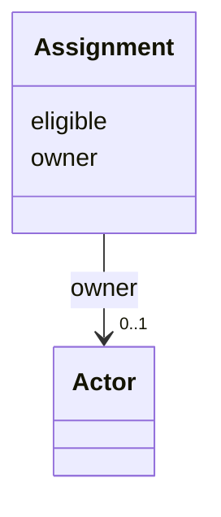

---
search:
  boost: 10.0
---

# Class: Assignment 


_Separates live ownership from authoring-time eligibility -- v1 conflated both into assigned_to. Absorbs task-045's assigned_to/supported_agents split._


<div data-search-exclude markdown="1">


URI: [aj:class/Assignment](https://github.com/jeffposey/agentjobs/schema/v2/class/Assignment)





<!-- no inheritance hierarchy -->

## Slots

| Name | Cardinality and Range | Description | Inheritance |
| ---  | --- | --- | --- |
| [owner](../slots/owner.md) | 0..1 <br/> [Actor](../classes/Actor.md) | Current owner, referenced by actor id (D4) | direct |
| [eligible](../slots/eligible.md) | * <br/> [String](../types/String.md) | Who may claim this task | direct |


## Usages

| used by | used in | type | used |
| ---  | --- | --- | --- |
| [Task](../classes/Task.md) | [assignment](../slots/assignment.md) | range | [Assignment](../classes/Assignment.md) |


## Identifier and Mapping Information


### Schema Source


* from schema: https://github.com/jeffposey/agentjobs/schema/v2


## Mappings

| Mapping Type | Mapped Value |
| ---  | ---  |
| self | aj:Assignment |
| native | aj:Assignment |


## LinkML Source

<!-- TODO: investigate https://stackoverflow.com/questions/37606292/how-to-create-tabbed-code-blocks-in-mkdocs-or-sphinx -->

### Direct

<details>
```yaml
name: Assignment
description: Separates live ownership from authoring-time eligibility -- v1 conflated
  both into assigned_to. Absorbs task-045's assigned_to/supported_agents split.
from_schema: https://github.com/jeffposey/agentjobs/schema/v2
attributes:
  owner:
    name: owner
    description: Current owner, referenced by actor id (D4). Set on claim, cleared
      on release or close. Absent or null in draft and ready, required while active
      (enforced in task-050, see note above).
    from_schema: https://github.com/jeffposey/agentjobs/schema/v2
    rank: 1000
    domain_of:
    - Assignment
    range: Actor
    inlined: false
  eligible:
    name: eligible
    description: Who may claim this task. An empty list means anyone. Authoring-time
      intent, never mutated by claiming.
    from_schema: https://github.com/jeffposey/agentjobs/schema/v2
    rank: 1000
    domain_of:
    - Assignment
    multivalued: true

```
</details>

### Induced

<details>
```yaml
name: Assignment
description: Separates live ownership from authoring-time eligibility -- v1 conflated
  both into assigned_to. Absorbs task-045's assigned_to/supported_agents split.
from_schema: https://github.com/jeffposey/agentjobs/schema/v2
attributes:
  owner:
    name: owner
    description: Current owner, referenced by actor id (D4). Set on claim, cleared
      on release or close. Absent or null in draft and ready, required while active
      (enforced in task-050, see note above).
    from_schema: https://github.com/jeffposey/agentjobs/schema/v2
    rank: 1000
    owner: Assignment
    domain_of:
    - Assignment
    range: Actor
    inlined: false
  eligible:
    name: eligible
    description: Who may claim this task. An empty list means anyone. Authoring-time
      intent, never mutated by claiming.
    from_schema: https://github.com/jeffposey/agentjobs/schema/v2
    rank: 1000
    owner: Assignment
    domain_of:
    - Assignment
    range: string
    multivalued: true

```
</details></div>