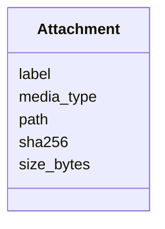

---
search:
  boost: 10.0
---

# Class: Attachment 


_One image stored beside the tasks, referenced from the log entry it illustrates. `sha256` is both the sidecar's filename and its integrity check: a read that does not hash to this is refused rather than rendered._


<div data-search-exclude markdown="1">


URI: [aj:class/Attachment](https://github.com/jeffposey/agentjobs/schema/v2/class/Attachment)





<!-- no inheritance hierarchy -->

## Slots

| Name | Cardinality and Range | Description | Inheritance |
| ---  | --- | --- | --- |
| [path](../slots/path.md) | 1 <br/> [String](../types/String.md) | Sidecar path, relative to the tasks directory rather than the repo root | direct |
| [media_type](../slots/media_type.md) | 1 <br/> [String](../types/String.md) | Image media type, derived from the bytes rather than the filename | direct |
| [sha256](../slots/sha256.md) | 1 <br/> [String](../types/String.md) | Content hash; also the sidecar's filename | direct |
| [size_bytes](../slots/size_bytes.md) | 1 <br/> [Integer](../types/Integer.md) | Size of the stored file | direct |
| [label](../slots/label.md) | 1 <br/> [String](../types/String.md) | Accessible label; alt text wherever it renders | direct |


## Usages

| used by | used in | type | used |
| ---  | --- | --- | --- |
| [LogEntry](../classes/LogEntry.md) | [attachments](../slots/attachments.md) | range | [Attachment](../classes/Attachment.md) |


## Identifier and Mapping Information


### Schema Source


* from schema: https://github.com/jeffposey/agentjobs/schema/v2


## Mappings

| Mapping Type | Mapped Value |
| ---  | ---  |
| self | aj:Attachment |
| native | aj:Attachment |


## LinkML Source

<!-- TODO: investigate https://stackoverflow.com/questions/37606292/how-to-create-tabbed-code-blocks-in-mkdocs-or-sphinx -->

### Direct

<details>
```yaml
name: Attachment
description: 'One image stored beside the tasks, referenced from the log entry it
  illustrates. `sha256` is both the sidecar''s filename and its integrity check: a
  read that does not hash to this is refused rather than rendered.'
from_schema: https://github.com/jeffposey/agentjobs/schema/v2
attributes:
  path:
    name: path
    description: Sidecar path, relative to the tasks directory rather than the repo
      root.
    from_schema: https://github.com/jeffposey/agentjobs/schema/v2
    domain_of:
    - ContextPointer
    - Deliverable
    - Attachment
    required: true
  media_type:
    name: media_type
    description: Image media type, derived from the bytes rather than the filename.
    from_schema: https://github.com/jeffposey/agentjobs/schema/v2
    rank: 1000
    domain_of:
    - Attachment
    required: true
  sha256:
    name: sha256
    description: Content hash; also the sidecar's filename.
    from_schema: https://github.com/jeffposey/agentjobs/schema/v2
    rank: 1000
    domain_of:
    - Attachment
    required: true
  size_bytes:
    name: size_bytes
    description: Size of the stored file.
    from_schema: https://github.com/jeffposey/agentjobs/schema/v2
    rank: 1000
    domain_of:
    - Attachment
    range: integer
    required: true
    minimum_value: 1
  label:
    name: label
    description: Accessible label; alt text wherever it renders.
    from_schema: https://github.com/jeffposey/agentjobs/schema/v2
    rank: 1000
    domain_of:
    - Attachment
    required: true

```
</details>

### Induced

<details>
```yaml
name: Attachment
description: 'One image stored beside the tasks, referenced from the log entry it
  illustrates. `sha256` is both the sidecar''s filename and its integrity check: a
  read that does not hash to this is refused rather than rendered.'
from_schema: https://github.com/jeffposey/agentjobs/schema/v2
attributes:
  path:
    name: path
    description: Sidecar path, relative to the tasks directory rather than the repo
      root.
    from_schema: https://github.com/jeffposey/agentjobs/schema/v2
    owner: Attachment
    domain_of:
    - ContextPointer
    - Deliverable
    - Attachment
    range: string
    required: true
  media_type:
    name: media_type
    description: Image media type, derived from the bytes rather than the filename.
    from_schema: https://github.com/jeffposey/agentjobs/schema/v2
    rank: 1000
    owner: Attachment
    domain_of:
    - Attachment
    range: string
    required: true
  sha256:
    name: sha256
    description: Content hash; also the sidecar's filename.
    from_schema: https://github.com/jeffposey/agentjobs/schema/v2
    rank: 1000
    owner: Attachment
    domain_of:
    - Attachment
    range: string
    required: true
  size_bytes:
    name: size_bytes
    description: Size of the stored file.
    from_schema: https://github.com/jeffposey/agentjobs/schema/v2
    rank: 1000
    owner: Attachment
    domain_of:
    - Attachment
    range: integer
    required: true
    minimum_value: 1
  label:
    name: label
    description: Accessible label; alt text wherever it renders.
    from_schema: https://github.com/jeffposey/agentjobs/schema/v2
    rank: 1000
    owner: Attachment
    domain_of:
    - Attachment
    range: string
    required: true

```
</details></div>