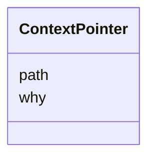

---
search:
  boost: 10.0
---

# Class: ContextPointer 


_A file worth reading before starting, and why it is worth reading._


<div data-search-exclude markdown="1">


URI: [aj:class/ContextPointer](https://github.com/jeffposey/agentjobs/schema/v2/class/ContextPointer)





<!-- no inheritance hierarchy -->

## Slots

| Name | Cardinality and Range | Description | Inheritance |
| ---  | --- | --- | --- |
| [path](../slots/path.md) | 1 <br/> [String](../types/String.md) | Repository-relative path | direct |
| [why](../slots/why.md) | 1 <br/> [String](../types/String.md) | What the reader will find there | direct |


## Usages

| used by | used in | type | used |
| ---  | --- | --- | --- |
| [Spec](../classes/Spec.md) | [context](../slots/context.md) | range | [ContextPointer](../classes/ContextPointer.md) |


## Identifier and Mapping Information


### Schema Source


* from schema: https://github.com/jeffposey/agentjobs/schema/v2


## Mappings

| Mapping Type | Mapped Value |
| ---  | ---  |
| self | aj:ContextPointer |
| native | aj:ContextPointer |


## LinkML Source

<!-- TODO: investigate https://stackoverflow.com/questions/37606292/how-to-create-tabbed-code-blocks-in-mkdocs-or-sphinx -->

### Direct

<details>
```yaml
name: ContextPointer
description: A file worth reading before starting, and why it is worth reading.
from_schema: https://github.com/jeffposey/agentjobs/schema/v2
attributes:
  path:
    name: path
    description: Repository-relative path.
    from_schema: https://github.com/jeffposey/agentjobs/schema/v2
    rank: 1000
    domain_of:
    - ContextPointer
    - Deliverable
    - Attachment
    required: true
  why:
    name: why
    description: What the reader will find there. Required -- a pointer without a
      reason is the kind of context that decays into noise.
    from_schema: https://github.com/jeffposey/agentjobs/schema/v2
    rank: 1000
    domain_of:
    - ContextPointer
    required: true

```
</details>

### Induced

<details>
```yaml
name: ContextPointer
description: A file worth reading before starting, and why it is worth reading.
from_schema: https://github.com/jeffposey/agentjobs/schema/v2
attributes:
  path:
    name: path
    description: Repository-relative path.
    from_schema: https://github.com/jeffposey/agentjobs/schema/v2
    rank: 1000
    owner: ContextPointer
    domain_of:
    - ContextPointer
    - Deliverable
    - Attachment
    range: string
    required: true
  why:
    name: why
    description: What the reader will find there. Required -- a pointer without a
      reason is the kind of context that decays into noise.
    from_schema: https://github.com/jeffposey/agentjobs/schema/v2
    rank: 1000
    owner: ContextPointer
    domain_of:
    - ContextPointer
    range: string
    required: true

```
</details></div>