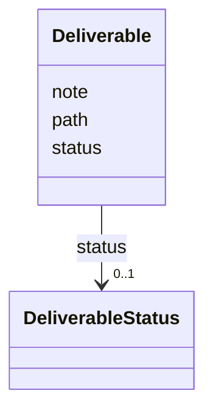

---
search:
  boost: 10.0
---

# Class: Deliverable 


_An artifact the task produces._


<div data-search-exclude markdown="1">


URI: [aj:class/Deliverable](https://github.com/jeffposey/agentjobs/schema/v2/class/Deliverable)





<!-- no inheritance hierarchy -->

## Slots

| Name | Cardinality and Range | Description | Inheritance |
| ---  | --- | --- | --- |
| [path](../slots/path.md) | 1 <br/> [String](../types/String.md) | Repository-relative path to the deliverable | direct |
| [note](../slots/note.md) | 0..1 <br/> [String](../types/String.md) | What it is | direct |
| [status](../slots/status.md) | 0..1 <br/> [DeliverableStatus](../enums/DeliverableStatus.md) |  | direct |


## Usages

| used by | used in | type | used |
| ---  | --- | --- | --- |
| [Task](../classes/Task.md) | [deliverables](../slots/deliverables.md) | range | [Deliverable](../classes/Deliverable.md) |


## Identifier and Mapping Information


### Schema Source


* from schema: https://github.com/jeffposey/agentjobs/schema/v2


## Mappings

| Mapping Type | Mapped Value |
| ---  | ---  |
| self | aj:Deliverable |
| native | aj:Deliverable |


## LinkML Source

<!-- TODO: investigate https://stackoverflow.com/questions/37606292/how-to-create-tabbed-code-blocks-in-mkdocs-or-sphinx -->

### Direct

<details>
```yaml
name: Deliverable
description: An artifact the task produces.
from_schema: https://github.com/jeffposey/agentjobs/schema/v2
attributes:
  path:
    name: path
    description: Repository-relative path to the deliverable.
    from_schema: https://github.com/jeffposey/agentjobs/schema/v2
    domain_of:
    - ContextPointer
    - Deliverable
    required: true
  note:
    name: note
    description: What it is. Renamed from v1's description, to free that word up.
    from_schema: https://github.com/jeffposey/agentjobs/schema/v2
    rank: 1000
    domain_of:
    - Deliverable
    - Dependency
  status:
    name: status
    from_schema: https://github.com/jeffposey/agentjobs/schema/v2
    ifabsent: string(pending)
    domain_of:
    - AcceptanceCriterion
    - Deliverable
    - Branch
    range: DeliverableStatus

```
</details>

### Induced

<details>
```yaml
name: Deliverable
description: An artifact the task produces.
from_schema: https://github.com/jeffposey/agentjobs/schema/v2
attributes:
  path:
    name: path
    description: Repository-relative path to the deliverable.
    from_schema: https://github.com/jeffposey/agentjobs/schema/v2
    owner: Deliverable
    domain_of:
    - ContextPointer
    - Deliverable
    range: string
    required: true
  note:
    name: note
    description: What it is. Renamed from v1's description, to free that word up.
    from_schema: https://github.com/jeffposey/agentjobs/schema/v2
    rank: 1000
    owner: Deliverable
    domain_of:
    - Deliverable
    - Dependency
    range: string
  status:
    name: status
    from_schema: https://github.com/jeffposey/agentjobs/schema/v2
    ifabsent: string(pending)
    owner: Deliverable
    domain_of:
    - AcceptanceCriterion
    - Deliverable
    - Branch
    range: DeliverableStatus

```
</details></div>