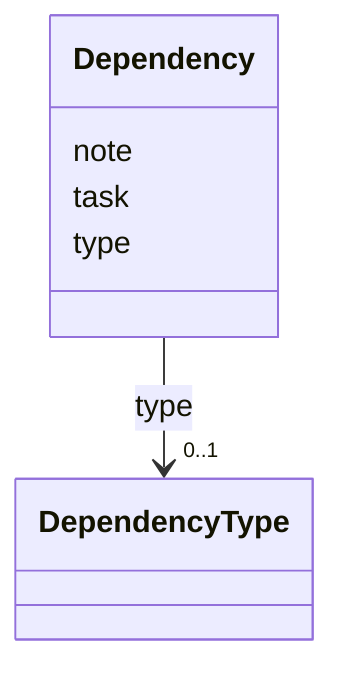

---
search:
  boost: 10.0
---

# Class: Dependency 


_A relationship to another task. Renamed from task_id to task, and now actually validated against the store at save. v1's purposeless `status` field is gone._


<div data-search-exclude markdown="1">


URI: [aj:class/Dependency](https://github.com/jeffposey/agentjobs/schema/v2/class/Dependency)





<!-- no inheritance hierarchy -->

## Slots

| Name | Cardinality and Range | Description | Inheritance |
| ---  | --- | --- | --- |
| [task](../slots/task.md) | 1 <br/> [String](../types/String.md) | Referenced task identifier | direct |
| [type](../slots/type.md) | 0..1 <br/> [DependencyType](../enums/DependencyType.md) |  | direct |
| [note](../slots/note.md) | 0..1 <br/> [String](../types/String.md) | Why the relationship exists | direct |


## Usages

| used by | used in | type | used |
| ---  | --- | --- | --- |
| [Task](../classes/Task.md) | [dependencies](../slots/dependencies.md) | range | [Dependency](../classes/Dependency.md) |


## Identifier and Mapping Information


### Schema Source


* from schema: https://github.com/jeffposey/agentjobs/schema/v2


## Mappings

| Mapping Type | Mapped Value |
| ---  | ---  |
| self | aj:Dependency |
| native | aj:Dependency |


## LinkML Source

<!-- TODO: investigate https://stackoverflow.com/questions/37606292/how-to-create-tabbed-code-blocks-in-mkdocs-or-sphinx -->

### Direct

<details>
```yaml
name: Dependency
description: A relationship to another task. Renamed from task_id to task, and now
  actually validated against the store at save. v1's purposeless `status` field is
  gone.
from_schema: https://github.com/jeffposey/agentjobs/schema/v2
attributes:
  task:
    name: task
    description: Referenced task identifier. Must exist in the store.
    from_schema: https://github.com/jeffposey/agentjobs/schema/v2
    rank: 1000
    domain_of:
    - Dependency
    required: true
  type:
    name: type
    from_schema: https://github.com/jeffposey/agentjobs/schema/v2
    rank: 1000
    ifabsent: string(needs)
    domain_of:
    - Dependency
    - LogEntry
    range: DependencyType
  note:
    name: note
    description: Why the relationship exists.
    from_schema: https://github.com/jeffposey/agentjobs/schema/v2
    domain_of:
    - Deliverable
    - Dependency

```
</details>

### Induced

<details>
```yaml
name: Dependency
description: A relationship to another task. Renamed from task_id to task, and now
  actually validated against the store at save. v1's purposeless `status` field is
  gone.
from_schema: https://github.com/jeffposey/agentjobs/schema/v2
attributes:
  task:
    name: task
    description: Referenced task identifier. Must exist in the store.
    from_schema: https://github.com/jeffposey/agentjobs/schema/v2
    rank: 1000
    owner: Dependency
    domain_of:
    - Dependency
    range: string
    required: true
  type:
    name: type
    from_schema: https://github.com/jeffposey/agentjobs/schema/v2
    rank: 1000
    ifabsent: string(needs)
    owner: Dependency
    domain_of:
    - Dependency
    - LogEntry
    range: DependencyType
  note:
    name: note
    description: Why the relationship exists.
    from_schema: https://github.com/jeffposey/agentjobs/schema/v2
    owner: Dependency
    domain_of:
    - Deliverable
    - Dependency
    range: string

```
</details></div>