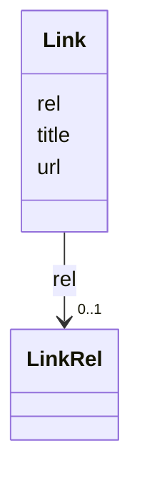

---
search:
  boost: 10.0
---

# Class: Link 


_An external reference, with its kind made explicit._


<div data-search-exclude markdown="1">


URI: [aj:class/Link](https://github.com/jeffposey/agentjobs/schema/v2/class/Link)





<!-- no inheritance hierarchy -->

## Slots

| Name | Cardinality and Range | Description | Inheritance |
| ---  | --- | --- | --- |
| [url](../slots/url.md) | 1 <br/> [Uri](../types/Uri.md) | Target URL | direct |
| [rel](../slots/rel.md) | 0..1 <br/> [LinkRel](../enums/LinkRel.md) | What this link is | direct |
| [title](../slots/title.md) | 0..1 <br/> [String](../types/String.md) | Display title | direct |


## Usages

| used by | used in | type | used |
| ---  | --- | --- | --- |
| [Task](../classes/Task.md) | [links](../slots/links.md) | range | [Link](../classes/Link.md) |


## Identifier and Mapping Information


### Schema Source


* from schema: https://github.com/jeffposey/agentjobs/schema/v2


## Mappings

| Mapping Type | Mapped Value |
| ---  | ---  |
| self | aj:Link |
| native | aj:Link |


## LinkML Source

<!-- TODO: investigate https://stackoverflow.com/questions/37606292/how-to-create-tabbed-code-blocks-in-mkdocs-or-sphinx -->

### Direct

<details>
```yaml
name: Link
description: An external reference, with its kind made explicit.
from_schema: https://github.com/jeffposey/agentjobs/schema/v2
attributes:
  url:
    name: url
    description: Target URL. Actually validated as a URI, unlike v1.
    from_schema: https://github.com/jeffposey/agentjobs/schema/v2
    rank: 1000
    domain_of:
    - Link
    range: uri
    required: true
  rel:
    name: rel
    description: What this link is.
    from_schema: https://github.com/jeffposey/agentjobs/schema/v2
    rank: 1000
    ifabsent: string(other)
    domain_of:
    - Link
    range: LinkRel
  title:
    name: title
    description: Display title.
    from_schema: https://github.com/jeffposey/agentjobs/schema/v2
    domain_of:
    - Task
    - Link

```
</details>

### Induced

<details>
```yaml
name: Link
description: An external reference, with its kind made explicit.
from_schema: https://github.com/jeffposey/agentjobs/schema/v2
attributes:
  url:
    name: url
    description: Target URL. Actually validated as a URI, unlike v1.
    from_schema: https://github.com/jeffposey/agentjobs/schema/v2
    rank: 1000
    owner: Link
    domain_of:
    - Link
    range: uri
    required: true
  rel:
    name: rel
    description: What this link is.
    from_schema: https://github.com/jeffposey/agentjobs/schema/v2
    rank: 1000
    ifabsent: string(other)
    owner: Link
    domain_of:
    - Link
    range: LinkRel
  title:
    name: title
    description: Display title.
    from_schema: https://github.com/jeffposey/agentjobs/schema/v2
    owner: Link
    domain_of:
    - Task
    - Link
    range: string

```
</details></div>