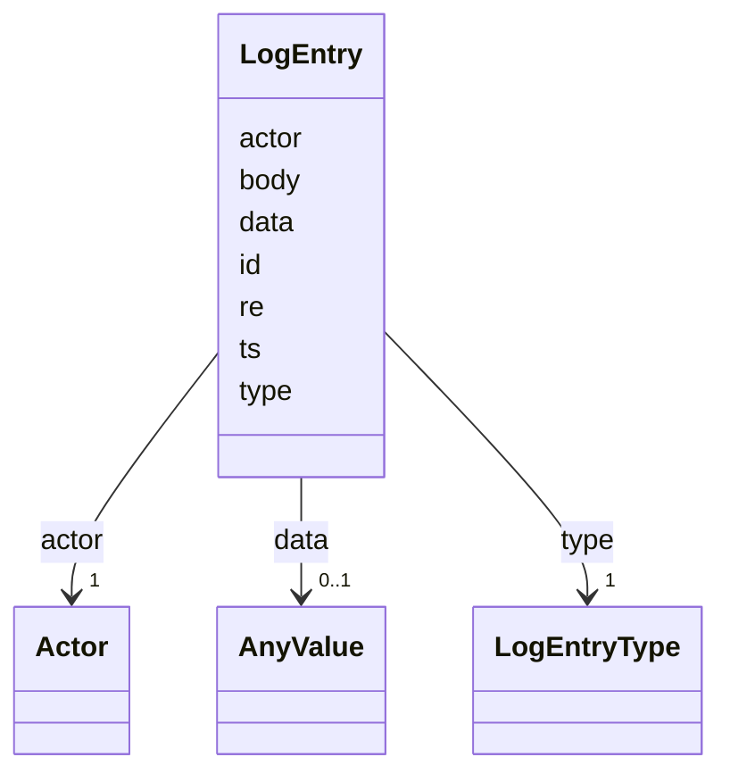

---
search:
  boost: 10.0
---

# Class: LogEntry 


_One immutable event in the task's history (section 4). Provenance lives at this layer: every entry carries a typed actor, and every state change flows through a logged transition. Field-level provenance was rejected as weight without readers._


<div data-search-exclude markdown="1">


URI: [aj:class/LogEntry](https://github.com/jeffposey/agentjobs/schema/v2/class/LogEntry)





<!-- no inheritance hierarchy -->

## Slots

| Name | Cardinality and Range | Description | Inheritance |
| ---  | --- | --- | --- |
| [id](../slots/id.md) | 1 <br/> [Integer](../types/Integer.md) | Per-task integer, assigned by the manager | direct |
| [ts](../slots/ts.md) | 1 <br/> [Datetime](../types/Datetime.md) | When the event happened | direct |
| [actor](../slots/actor.md) | 1 <br/> [Actor](../classes/Actor.md) | Who or what produced this entry, referenced by actor id (D4) | direct |
| [type](../slots/type.md) | 1 <br/> [LogEntryType](../enums/LogEntryType.md) |  | direct |
| [re](../slots/re.md) | 0..1 <br/> [Integer](../types/Integer.md) | Optional id of an earlier entry this one responds to | direct |
| [body](../slots/body.md) | 0..1 <br/> [String](../types/String.md) | The human-readable content | direct |
| [data](../slots/data.md) | 0..1 <br/> [AnyValue](../classes/AnyValue.md) | Optional structured payload, typed per entry type | direct |


## Usages

| used by | used in | type | used |
| ---  | --- | --- | --- |
| [Task](../classes/Task.md) | [log](../slots/log.md) | range | [LogEntry](../classes/LogEntry.md) |


## Identifier and Mapping Information


### Schema Source


* from schema: https://github.com/jeffposey/agentjobs/schema/v2


## Mappings

| Mapping Type | Mapped Value |
| ---  | ---  |
| self | aj:LogEntry |
| native | aj:LogEntry |


## LinkML Source

<!-- TODO: investigate https://stackoverflow.com/questions/37606292/how-to-create-tabbed-code-blocks-in-mkdocs-or-sphinx -->

### Direct

<details>
```yaml
name: LogEntry
description: 'One immutable event in the task''s history (section 4). Provenance lives
  at this layer: every entry carries a typed actor, and every state change flows through
  a logged transition. Field-level provenance was rejected as weight without readers.'
from_schema: https://github.com/jeffposey/agentjobs/schema/v2
attributes:
  id:
    name: id
    description: Per-task integer, assigned by the manager. Defines order.
    from_schema: https://github.com/jeffposey/agentjobs/schema/v2
    domain_of:
    - Task
    - Actor
    - AcceptanceCriterion
    - LogEntry
    range: integer
    required: true
  ts:
    name: ts
    description: When the event happened.
    from_schema: https://github.com/jeffposey/agentjobs/schema/v2
    rank: 1000
    domain_of:
    - LogEntry
    range: datetime
    required: true
  actor:
    name: actor
    description: Who or what produced this entry, referenced by actor id (D4). `kind`
      is resolved from config and is never stored here.
    from_schema: https://github.com/jeffposey/agentjobs/schema/v2
    rank: 1000
    domain_of:
    - LogEntry
    range: Actor
    required: true
    inlined: false
  type:
    name: type
    from_schema: https://github.com/jeffposey/agentjobs/schema/v2
    domain_of:
    - Dependency
    - LogEntry
    range: LogEntryType
    required: true
  re:
    name: re
    description: Optional id of an earlier entry this one responds to. How an `answer`
      attaches to its `question`.
    from_schema: https://github.com/jeffposey/agentjobs/schema/v2
    rank: 1000
    domain_of:
    - LogEntry
    range: integer
  body:
    name: body
    description: The human-readable content. Markdown. For `handoff` entries this
      is the ask, mirroring ball_prompt; for `decision` entries it must include the
      rejected alternative.
    from_schema: https://github.com/jeffposey/agentjobs/schema/v2
    rank: 1000
    domain_of:
    - LogEntry
  data:
    name: data
    description: 'Optional structured payload, typed per entry type. For `transition`
      entries it carries the state delta, e.g. {lifecycle: active, ball: agent, ball_reason:
      work}. Deliberately unconstrained at the schema level; the per-type shape is
      validated by the manager that writes it.'
    from_schema: https://github.com/jeffposey/agentjobs/schema/v2
    rank: 1000
    domain_of:
    - LogEntry
    range: AnyValue
    inlined: true

```
</details>

### Induced

<details>
```yaml
name: LogEntry
description: 'One immutable event in the task''s history (section 4). Provenance lives
  at this layer: every entry carries a typed actor, and every state change flows through
  a logged transition. Field-level provenance was rejected as weight without readers.'
from_schema: https://github.com/jeffposey/agentjobs/schema/v2
attributes:
  id:
    name: id
    description: Per-task integer, assigned by the manager. Defines order.
    from_schema: https://github.com/jeffposey/agentjobs/schema/v2
    owner: LogEntry
    domain_of:
    - Task
    - Actor
    - AcceptanceCriterion
    - LogEntry
    range: integer
    required: true
  ts:
    name: ts
    description: When the event happened.
    from_schema: https://github.com/jeffposey/agentjobs/schema/v2
    rank: 1000
    owner: LogEntry
    domain_of:
    - LogEntry
    range: datetime
    required: true
  actor:
    name: actor
    description: Who or what produced this entry, referenced by actor id (D4). `kind`
      is resolved from config and is never stored here.
    from_schema: https://github.com/jeffposey/agentjobs/schema/v2
    rank: 1000
    owner: LogEntry
    domain_of:
    - LogEntry
    range: Actor
    required: true
    inlined: false
  type:
    name: type
    from_schema: https://github.com/jeffposey/agentjobs/schema/v2
    owner: LogEntry
    domain_of:
    - Dependency
    - LogEntry
    range: LogEntryType
    required: true
  re:
    name: re
    description: Optional id of an earlier entry this one responds to. How an `answer`
      attaches to its `question`.
    from_schema: https://github.com/jeffposey/agentjobs/schema/v2
    rank: 1000
    owner: LogEntry
    domain_of:
    - LogEntry
    range: integer
  body:
    name: body
    description: The human-readable content. Markdown. For `handoff` entries this
      is the ask, mirroring ball_prompt; for `decision` entries it must include the
      rejected alternative.
    from_schema: https://github.com/jeffposey/agentjobs/schema/v2
    rank: 1000
    owner: LogEntry
    domain_of:
    - LogEntry
    range: string
  data:
    name: data
    description: 'Optional structured payload, typed per entry type. For `transition`
      entries it carries the state delta, e.g. {lifecycle: active, ball: agent, ball_reason:
      work}. Deliberately unconstrained at the schema level; the per-type shape is
      validated by the manager that writes it.'
    from_schema: https://github.com/jeffposey/agentjobs/schema/v2
    rank: 1000
    owner: LogEntry
    domain_of:
    - LogEntry
    range: AnyValue
    inlined: true

```
</details></div>