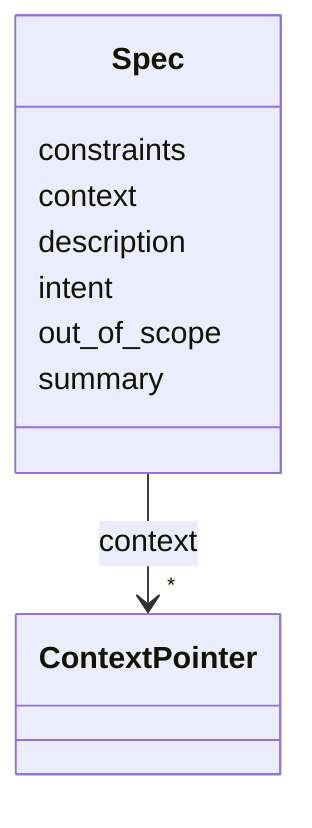

---
search:
  boost: 10.0
---

# Class: Spec 


_The working specification, split along the questions agents actually ask. Read in order, this is the first half of the resumption contract (section 5)._


<div data-search-exclude markdown="1">


URI: [aj:class/Spec](https://github.com/jeffposey/agentjobs/schema/v2/class/Spec)





<!-- no inheritance hierarchy -->

## Slots

| Name | Cardinality and Range | Description | Inheritance |
| ---  | --- | --- | --- |
| [summary](../slots/summary.md) | 1 <br/> [String](../types/String.md) | One to two sentences | direct |
| [intent](../slots/intent.md) | 1 <br/> [String](../types/String.md) | WHY this task exists | direct |
| [description](../slots/description.md) | 1 <br/> [String](../types/String.md) | WHAT to do -- the working spec | direct |
| [constraints](../slots/constraints.md) | 0..1 <br/> [String](../types/String.md) | Hard requirements and prohibitions | direct |
| [out_of_scope](../slots/out_of_scope.md) | 0..1 <br/> [String](../types/String.md) | Explicit non-goals, so agents do not wander | direct |
| [context](../slots/context.md) | * <br/> [ContextPointer](../classes/ContextPointer.md) | Curated read-this-first pointers, each with a reason | direct |


## Usages

| used by | used in | type | used |
| ---  | --- | --- | --- |
| [Task](../classes/Task.md) | [spec](../slots/spec.md) | range | [Spec](../classes/Spec.md) |


## Identifier and Mapping Information


### Schema Source


* from schema: https://github.com/jeffposey/agentjobs/schema/v2


## Mappings

| Mapping Type | Mapped Value |
| ---  | ---  |
| self | aj:Spec |
| native | aj:Spec |


## LinkML Source

<!-- TODO: investigate https://stackoverflow.com/questions/37606292/how-to-create-tabbed-code-blocks-in-mkdocs-or-sphinx -->

### Direct

<details>
```yaml
name: Spec
description: The working specification, split along the questions agents actually
  ask. Read in order, this is the first half of the resumption contract (section 5).
from_schema: https://github.com/jeffposey/agentjobs/schema/v2
attributes:
  summary:
    name: summary
    description: One to two sentences. The only summary, for every audience -- v1's
      human_summary split by length rather than by content.
    from_schema: https://github.com/jeffposey/agentjobs/schema/v2
    rank: 1000
    domain_of:
    - Spec
    required: true
  intent:
    name: intent
    description: WHY this task exists. Markdown.
    from_schema: https://github.com/jeffposey/agentjobs/schema/v2
    rank: 1000
    domain_of:
    - Spec
    required: true
  description:
    name: description
    description: WHAT to do -- the working spec. Markdown.
    from_schema: https://github.com/jeffposey/agentjobs/schema/v2
    rank: 1000
    domain_of:
    - Spec
    required: true
  constraints:
    name: constraints
    description: Hard requirements and prohibitions. Markdown.
    from_schema: https://github.com/jeffposey/agentjobs/schema/v2
    rank: 1000
    domain_of:
    - Spec
  out_of_scope:
    name: out_of_scope
    description: 'Explicit non-goals, so agents do not wander. Markdown. Note: this
      is the field that would have prevented task-048''s own scope drift.'
    from_schema: https://github.com/jeffposey/agentjobs/schema/v2
    rank: 1000
    domain_of:
    - Spec
  context:
    name: context
    description: Curated read-this-first pointers, each with a reason.
    from_schema: https://github.com/jeffposey/agentjobs/schema/v2
    rank: 1000
    domain_of:
    - Spec
    range: ContextPointer
    multivalued: true
    inlined_as_list: true

```
</details>

### Induced

<details>
```yaml
name: Spec
description: The working specification, split along the questions agents actually
  ask. Read in order, this is the first half of the resumption contract (section 5).
from_schema: https://github.com/jeffposey/agentjobs/schema/v2
attributes:
  summary:
    name: summary
    description: One to two sentences. The only summary, for every audience -- v1's
      human_summary split by length rather than by content.
    from_schema: https://github.com/jeffposey/agentjobs/schema/v2
    rank: 1000
    owner: Spec
    domain_of:
    - Spec
    range: string
    required: true
  intent:
    name: intent
    description: WHY this task exists. Markdown.
    from_schema: https://github.com/jeffposey/agentjobs/schema/v2
    rank: 1000
    owner: Spec
    domain_of:
    - Spec
    range: string
    required: true
  description:
    name: description
    description: WHAT to do -- the working spec. Markdown.
    from_schema: https://github.com/jeffposey/agentjobs/schema/v2
    rank: 1000
    owner: Spec
    domain_of:
    - Spec
    range: string
    required: true
  constraints:
    name: constraints
    description: Hard requirements and prohibitions. Markdown.
    from_schema: https://github.com/jeffposey/agentjobs/schema/v2
    rank: 1000
    owner: Spec
    domain_of:
    - Spec
    range: string
  out_of_scope:
    name: out_of_scope
    description: 'Explicit non-goals, so agents do not wander. Markdown. Note: this
      is the field that would have prevented task-048''s own scope drift.'
    from_schema: https://github.com/jeffposey/agentjobs/schema/v2
    rank: 1000
    owner: Spec
    domain_of:
    - Spec
    range: string
  context:
    name: context
    description: Curated read-this-first pointers, each with a reason.
    from_schema: https://github.com/jeffposey/agentjobs/schema/v2
    rank: 1000
    owner: Spec
    domain_of:
    - Spec
    range: ContextPointer
    multivalued: true
    inlined: true
    inlined_as_list: true

```
</details></div>