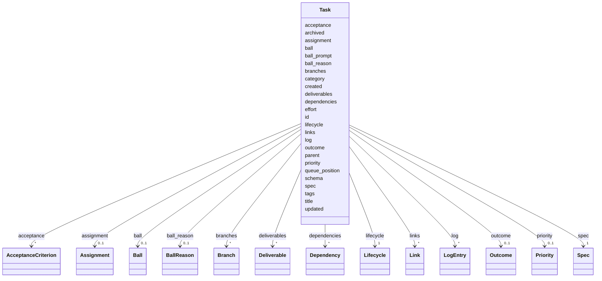

---
search:
  boost: 10.0
---

# Class: Task 


_A unit of work. One YAML file per task, in git -- diffable, reviewable, blame-able, mergeable. Hand-editing remains a first-class interface (D2)._


<div data-search-exclude markdown="1">


URI: [aj:class/Task](https://github.com/jeffposey/agentjobs/schema/v2/class/Task)





<!-- no inheritance hierarchy -->

## Class Properties

| Property | Value |
| --- | --- |
| Tree Root | Yes |


## Slots

| Name | Cardinality and Range | Description | Inheritance |
| ---  | --- | --- | --- |
| [schema](../slots/schema.md) | 1 <br/> [Integer](../types/Integer.md) | Schema version stamp | direct |
| [id](../slots/id.md) | 1 <br/> [String](../types/String.md) | Unique task identifier (e | direct |
| [title](../slots/title.md) | 1 <br/> [String](../types/String.md) | Task title summarising the work | direct |
| [created](../slots/created.md) | 1 <br/> [Datetime](../types/Datetime.md) | Creation timestamp | direct |
| [updated](../slots/updated.md) | 1 <br/> [Datetime](../types/Datetime.md) | Last update timestamp | direct |
| [lifecycle](../slots/lifecycle.md) | 1 <br/> [Lifecycle](../enums/Lifecycle.md) | Where the task is in its life | direct |
| [ball](../slots/ball.md) | 0..1 <br/> [Ball](../enums/Ball.md) | Who acts next | direct |
| [ball_reason](../slots/ball_reason.md) | 0..1 <br/> [BallReason](../enums/BallReason.md) | Why the ball holder holds it | direct |
| [ball_prompt](../slots/ball_prompt.md) | 0..1 <br/> [String](../types/String.md) | The ask, in prose, addressed to whoever holds the ball | direct |
| [outcome](../slots/outcome.md) | 0..1 <br/> [Outcome](../enums/Outcome.md) | How the task ended | direct |
| [archived](../slots/archived.md) | 0..1 <br/> [Boolean](../types/Boolean.md) | Visibility flag, orthogonal to how the task ended | direct |
| [priority](../slots/priority.md) | 0..1 <br/> [Priority](../enums/Priority.md) |  | direct |
| [queue_position](../slots/queue_position.md) | 0..1 <br/> [Integer](../types/Integer.md) | Explicit order within the priority band | direct |
| [category](../slots/category.md) | 1 <br/> [String](../types/String.md) | Validated against the project config vocabulary at save time, not enumerated ... | direct |
| [tags](../slots/tags.md) | * <br/> [String](../types/String.md) | Also validated against the config vocabulary at save | direct |
| [effort](../slots/effort.md) | 0..1 <br/> [String](../types/String.md) | Free text; renamed from estimated_effort | direct |
| [assignment](../slots/assignment.md) | 0..1 <br/> [Assignment](../classes/Assignment.md) | Live ownership plus authoring-time eligibility | direct |
| [parent](../slots/parent.md) | 0..1 <br/> [String](../types/String.md) | Task id of an umbrella task | direct |
| [spec](../slots/spec.md) | 1 <br/> [Spec](../classes/Spec.md) | The structured briefing | direct |
| [acceptance](../slots/acceptance.md) | * <br/> [AcceptanceCriterion](../classes/AcceptanceCriterion.md) | What "done" means | direct |
| [deliverables](../slots/deliverables.md) | * <br/> [Deliverable](../classes/Deliverable.md) | Artifacts the task is expected to produce | direct |
| [dependencies](../slots/dependencies.md) | * <br/> [Dependency](../classes/Dependency.md) | Relationships to other tasks | direct |
| [links](../slots/links.md) | * <br/> [Link](../classes/Link.md) | External references | direct |
| [branches](../slots/branches.md) | * <br/> [Branch](../classes/Branch.md) | Git branches associated with the task | direct |
| [log](../slots/log.md) | * <br/> [LogEntry](../classes/LogEntry.md) | One append-only typed log (section 4) | direct |


## Rules


### closed_has_outcome_and_no_ball

| Rule Applied | Preconditions | Postconditions | Elseconditions |
|--------------|---------------|----------------|----------------|
| slot_conditions |```{'lifecycle': {'equals_string': 'closed'}}``` |```{'ball': {'value_presence': 'ABSENT'}, 'outcome': {'value_presence': 'PRESENT'}}``` | |


### open_names_who_acts_next_and_the_ask

| Rule Applied | Preconditions | Postconditions | Elseconditions |
|--------------|---------------|----------------|----------------|
| slot_conditions |```{'lifecycle': {'any_of': [{'equals_string': 'draft'}, {'equals_string': 'ready'}, {'equals_string': 'active'}]}}``` |```{'ball': {'value_presence': 'PRESENT'}, 'outcome': {'value_presence': 'ABSENT'}}``` | |


### open_tasks_state_their_ask

| Rule Applied | Preconditions | Postconditions | Elseconditions |
|--------------|---------------|----------------|----------------|
| none_of |```[{'slot_conditions': {'ball_reason': {'equals_string': 'available'}}}]``` | | |
| slot_conditions |```{'lifecycle': {'any_of': [{'equals_string': 'draft'}, {'equals_string': 'ready'}, {'equals_string': 'active'}]}}``` |```{'ball_prompt': {'value_presence': 'PRESENT'}}``` | |


### agent_ball_reason_vocabulary

| Rule Applied | Preconditions | Postconditions | Elseconditions |
|--------------|---------------|----------------|----------------|
| slot_conditions |```{'ball': {'equals_string': 'agent'}}``` |```{'ball_reason': {'any_of': [{'equals_string': 'available'}, {'equals_string': 'work'}, {'equals_string': 'revise'}, {'equals_string': 'answer'}, {'equals_string': 'redirect'}, {'equals_string': 'hold'}]}}``` | |


### human_ball_reason_vocabulary

| Rule Applied | Preconditions | Postconditions | Elseconditions |
|--------------|---------------|----------------|----------------|
| slot_conditions |```{'ball': {'equals_string': 'human'}}``` |```{'ball_reason': {'any_of': [{'equals_string': 'spec'}, {'equals_string': 'review'}, {'equals_string': 'decision'}, {'equals_string': 'approval'}, {'equals_string': 'input'}]}}``` | |


### external_ball_reason_vocabulary

| Rule Applied | Preconditions | Postconditions | Elseconditions |
|--------------|---------------|----------------|----------------|
| slot_conditions |```{'ball': {'equals_string': 'external'}}``` |```{'ball_reason': {'any_of': [{'equals_string': 'dependency'}, {'equals_string': 'service'}]}}``` | |


## Identifier and Mapping Information


### Schema Source


* from schema: https://github.com/jeffposey/agentjobs/schema/v2


## Mappings

| Mapping Type | Mapped Value |
| ---  | ---  |
| self | aj:Task |
| native | aj:Task |


## LinkML Source

<!-- TODO: investigate https://stackoverflow.com/questions/37606292/how-to-create-tabbed-code-blocks-in-mkdocs-or-sphinx -->

### Direct

<details>
```yaml
name: Task
description: A unit of work. One YAML file per task, in git -- diffable, reviewable,
  blame-able, mergeable. Hand-editing remains a first-class interface (D2).
from_schema: https://github.com/jeffposey/agentjobs/schema/v2
attributes:
  schema:
    name: schema
    description: 'Schema version stamp. A missing `schema` field means v1, which the
      v2 loader refuses loudly rather than guessing. Breaking changes bump this integer
      and ship a converter; additive changes do not bump it. NOTE for task-050: as
      a Pydantic field name, `schema` shadows a deprecated BaseModel attribute and
      will emit a shadow warning -- needs an alias or a model_config allowance.'
    from_schema: https://github.com/jeffposey/agentjobs/schema/v2
    rank: 1000
    domain_of:
    - Task
    range: integer
    required: true
    equals_number: 2
  id:
    name: id
    description: Unique task identifier (e.g. task-050-schema-v2-models).
    from_schema: https://github.com/jeffposey/agentjobs/schema/v2
    rank: 1000
    identifier: true
    domain_of:
    - Task
    - Actor
    - AcceptanceCriterion
    - LogEntry
    required: true
  title:
    name: title
    description: Task title summarising the work.
    from_schema: https://github.com/jeffposey/agentjobs/schema/v2
    rank: 1000
    domain_of:
    - Task
    - Link
    required: true
  created:
    name: created
    description: Creation timestamp.
    from_schema: https://github.com/jeffposey/agentjobs/schema/v2
    rank: 1000
    domain_of:
    - Task
    range: datetime
    required: true
  updated:
    name: updated
    description: Last update timestamp.
    from_schema: https://github.com/jeffposey/agentjobs/schema/v2
    rank: 1000
    domain_of:
    - Task
    range: datetime
    required: true
  lifecycle:
    name: lifecycle
    description: Where the task is in its life.
    from_schema: https://github.com/jeffposey/agentjobs/schema/v2
    rank: 1000
    ifabsent: string(draft)
    domain_of:
    - Task
    range: Lifecycle
    required: true
  ball:
    name: ball
    description: Who acts next. Required while open; absent or null when closed. This
      is the field that makes limbo unrepresentable.
    from_schema: https://github.com/jeffposey/agentjobs/schema/v2
    rank: 1000
    domain_of:
    - Task
    range: Ball
  ball_reason:
    name: ball_reason
    description: Why the ball holder holds it. Must belong to that holder's vocabulary
      -- see the rules on this class.
    from_schema: https://github.com/jeffposey/agentjobs/schema/v2
    rank: 1000
    domain_of:
    - Task
    range: BallReason
  ball_prompt:
    name: ball_prompt
    description: 'The ask, in prose, addressed to whoever holds the ball. Required
      whenever the ball is set (tenet 3): a handoff without its payload is rejected
      at the schema level. May default for agent/available, where the spec is the
      ask.'
    from_schema: https://github.com/jeffposey/agentjobs/schema/v2
    rank: 1000
    domain_of:
    - Task
  outcome:
    name: outcome
    description: How the task ended. Set if and only if lifecycle is closed; absent
      or null while open.
    from_schema: https://github.com/jeffposey/agentjobs/schema/v2
    rank: 1000
    domain_of:
    - Task
    range: Outcome
  archived:
    name: archived
    description: Visibility flag, orthogonal to how the task ended. Lets an old completed
      task and an abandoned draft both be hidden without destroying what they were.
    from_schema: https://github.com/jeffposey/agentjobs/schema/v2
    rank: 1000
    ifabsent: 'false'
    domain_of:
    - Task
    range: boolean
  priority:
    name: priority
    from_schema: https://github.com/jeffposey/agentjobs/schema/v2
    rank: 1000
    ifabsent: string(medium)
    domain_of:
    - Task
    range: Priority
  queue_position:
    name: queue_position
    description: Explicit order within the priority band. Unique among open tasks
      of the same priority in one project. Present if and only if the task is open.
      Assigned in sparse steps of 100 so an insertion takes a midpoint and rewrites
      one file rather than a whole band.
    from_schema: https://github.com/jeffposey/agentjobs/schema/v2
    rank: 1000
    domain_of:
    - Task
    range: integer
    minimum_value: 1
  category:
    name: category
    description: Validated against the project config vocabulary at save time, not
      enumerated in this schema -- taxonomy is project-local, semantics are not.
    from_schema: https://github.com/jeffposey/agentjobs/schema/v2
    rank: 1000
    domain_of:
    - Task
    required: true
  tags:
    name: tags
    description: Also validated against the config vocabulary at save.
    from_schema: https://github.com/jeffposey/agentjobs/schema/v2
    rank: 1000
    domain_of:
    - Task
    multivalued: true
  effort:
    name: effort
    description: Free text; renamed from estimated_effort. It is an estimate, not
      a contract, so it is deliberately unstructured.
    from_schema: https://github.com/jeffposey/agentjobs/schema/v2
    rank: 1000
    domain_of:
    - Task
  assignment:
    name: assignment
    description: Live ownership plus authoring-time eligibility.
    from_schema: https://github.com/jeffposey/agentjobs/schema/v2
    rank: 1000
    domain_of:
    - Task
    range: Assignment
    inlined: true
  parent:
    name: parent
    description: Task id of an umbrella task. Tasks with open children are never claimable.
      Absorbs task-045's parent/child design.
    from_schema: https://github.com/jeffposey/agentjobs/schema/v2
    rank: 1000
    domain_of:
    - Task
  spec:
    name: spec
    description: The structured briefing. Replaces v1's single description blob and
      its duplicated starter prompt.
    from_schema: https://github.com/jeffposey/agentjobs/schema/v2
    rank: 1000
    domain_of:
    - Task
    range: Spec
    required: true
    inlined: true
  acceptance:
    name: acceptance
    description: What "done" means. Replaces success_criteria.
    from_schema: https://github.com/jeffposey/agentjobs/schema/v2
    rank: 1000
    domain_of:
    - Task
    range: AcceptanceCriterion
    multivalued: true
    inlined_as_list: true
  deliverables:
    name: deliverables
    description: Artifacts the task is expected to produce.
    from_schema: https://github.com/jeffposey/agentjobs/schema/v2
    rank: 1000
    domain_of:
    - Task
    range: Deliverable
    multivalued: true
    inlined_as_list: true
  dependencies:
    name: dependencies
    description: Relationships to other tasks. Validated against the store at save.
    from_schema: https://github.com/jeffposey/agentjobs/schema/v2
    rank: 1000
    domain_of:
    - Task
    range: Dependency
    multivalued: true
    inlined_as_list: true
  links:
    name: links
    description: External references. Renamed from external_links; URL now validated.
    from_schema: https://github.com/jeffposey/agentjobs/schema/v2
    rank: 1000
    domain_of:
    - Task
    range: Link
    multivalued: true
    inlined_as_list: true
  branches:
    name: branches
    description: Git branches associated with the task.
    from_schema: https://github.com/jeffposey/agentjobs/schema/v2
    rank: 1000
    domain_of:
    - Task
    range: Branch
    multivalued: true
    inlined_as_list: true
  log:
    name: log
    description: One append-only typed log (section 4). Entries are immutable and
      ordered. Replaces status_updates + comments + prompts.followups.
    from_schema: https://github.com/jeffposey/agentjobs/schema/v2
    rank: 1000
    domain_of:
    - Task
    range: LogEntry
    multivalued: true
    inlined_as_list: true
tree_root: true
rules:
- preconditions:
    slot_conditions:
      lifecycle:
        name: lifecycle
        equals_string: closed
  postconditions:
    slot_conditions:
      ball:
        name: ball
        value_presence: ABSENT
      outcome:
        name: outcome
        value_presence: PRESENT
  description: 'Rule 1 and 3: ball is absent-or-null if and only if lifecycle is closed,
    and outcome is set if and only if lifecycle is closed. ABSENT below means "absent
    or null" -- see the null-and-absent note in the schema description.'
  title: closed_has_outcome_and_no_ball
- preconditions:
    slot_conditions:
      lifecycle:
        name: lifecycle
        any_of:
        - equals_string: draft
        - equals_string: ready
        - equals_string: active
  postconditions:
    slot_conditions:
      ball:
        name: ball
        value_presence: PRESENT
      outcome:
        name: outcome
        value_presence: ABSENT
  description: Any open task must name who acts next and state the ask, and must not
    carry an outcome.
  title: open_names_who_acts_next_and_the_ask
- preconditions:
    none_of:
    - slot_conditions:
        ball_reason:
          name: ball_reason
          equals_string: available
    slot_conditions:
      lifecycle:
        name: lifecycle
        any_of:
        - equals_string: draft
        - equals_string: ready
        - equals_string: active
  postconditions:
    slot_conditions:
      ball_prompt:
        name: ball_prompt
        value_presence: PRESENT
  description: 'Rule 4 (tenet 3): a handoff without its payload is a notification
    with no content. Split from the rule above so the one documented exception can
    be expressed -- agent/available may omit it, because an unclaimed ready task''s
    ask is its spec.'
  title: open_tasks_state_their_ask
- preconditions:
    slot_conditions:
      ball:
        name: ball
        equals_string: agent
  postconditions:
    slot_conditions:
      ball_reason:
        name: ball_reason
        any_of:
        - equals_string: available
        - equals_string: work
        - equals_string: revise
        - equals_string: answer
        - equals_string: redirect
        - equals_string: hold
  description: 'Rule 2, agent side: available | work | revise | answer | redirect
    | hold.'
  title: agent_ball_reason_vocabulary
- preconditions:
    slot_conditions:
      ball:
        name: ball
        equals_string: human
  postconditions:
    slot_conditions:
      ball_reason:
        name: ball_reason
        any_of:
        - equals_string: spec
        - equals_string: review
        - equals_string: decision
        - equals_string: approval
        - equals_string: input
  description: 'Rule 2, human side: spec | review | decision | approval | input.'
  title: human_ball_reason_vocabulary
- preconditions:
    slot_conditions:
      ball:
        name: ball
        equals_string: external
  postconditions:
    slot_conditions:
      ball_reason:
        name: ball_reason
        any_of:
        - equals_string: dependency
        - equals_string: service
  description: 'Rule 2, external side: dependency | service.'
  title: external_ball_reason_vocabulary

```
</details>

### Induced

<details>
```yaml
name: Task
description: A unit of work. One YAML file per task, in git -- diffable, reviewable,
  blame-able, mergeable. Hand-editing remains a first-class interface (D2).
from_schema: https://github.com/jeffposey/agentjobs/schema/v2
attributes:
  schema:
    name: schema
    description: 'Schema version stamp. A missing `schema` field means v1, which the
      v2 loader refuses loudly rather than guessing. Breaking changes bump this integer
      and ship a converter; additive changes do not bump it. NOTE for task-050: as
      a Pydantic field name, `schema` shadows a deprecated BaseModel attribute and
      will emit a shadow warning -- needs an alias or a model_config allowance.'
    from_schema: https://github.com/jeffposey/agentjobs/schema/v2
    rank: 1000
    owner: Task
    domain_of:
    - Task
    range: integer
    required: true
    equals_number: 2
  id:
    name: id
    description: Unique task identifier (e.g. task-050-schema-v2-models).
    from_schema: https://github.com/jeffposey/agentjobs/schema/v2
    rank: 1000
    identifier: true
    owner: Task
    domain_of:
    - Task
    - Actor
    - AcceptanceCriterion
    - LogEntry
    range: string
    required: true
  title:
    name: title
    description: Task title summarising the work.
    from_schema: https://github.com/jeffposey/agentjobs/schema/v2
    rank: 1000
    owner: Task
    domain_of:
    - Task
    - Link
    range: string
    required: true
  created:
    name: created
    description: Creation timestamp.
    from_schema: https://github.com/jeffposey/agentjobs/schema/v2
    rank: 1000
    owner: Task
    domain_of:
    - Task
    range: datetime
    required: true
  updated:
    name: updated
    description: Last update timestamp.
    from_schema: https://github.com/jeffposey/agentjobs/schema/v2
    rank: 1000
    owner: Task
    domain_of:
    - Task
    range: datetime
    required: true
  lifecycle:
    name: lifecycle
    description: Where the task is in its life.
    from_schema: https://github.com/jeffposey/agentjobs/schema/v2
    rank: 1000
    ifabsent: string(draft)
    owner: Task
    domain_of:
    - Task
    range: Lifecycle
    required: true
  ball:
    name: ball
    description: Who acts next. Required while open; absent or null when closed. This
      is the field that makes limbo unrepresentable.
    from_schema: https://github.com/jeffposey/agentjobs/schema/v2
    rank: 1000
    owner: Task
    domain_of:
    - Task
    range: Ball
  ball_reason:
    name: ball_reason
    description: Why the ball holder holds it. Must belong to that holder's vocabulary
      -- see the rules on this class.
    from_schema: https://github.com/jeffposey/agentjobs/schema/v2
    rank: 1000
    owner: Task
    domain_of:
    - Task
    range: BallReason
  ball_prompt:
    name: ball_prompt
    description: 'The ask, in prose, addressed to whoever holds the ball. Required
      whenever the ball is set (tenet 3): a handoff without its payload is rejected
      at the schema level. May default for agent/available, where the spec is the
      ask.'
    from_schema: https://github.com/jeffposey/agentjobs/schema/v2
    rank: 1000
    owner: Task
    domain_of:
    - Task
    range: string
  outcome:
    name: outcome
    description: How the task ended. Set if and only if lifecycle is closed; absent
      or null while open.
    from_schema: https://github.com/jeffposey/agentjobs/schema/v2
    rank: 1000
    owner: Task
    domain_of:
    - Task
    range: Outcome
  archived:
    name: archived
    description: Visibility flag, orthogonal to how the task ended. Lets an old completed
      task and an abandoned draft both be hidden without destroying what they were.
    from_schema: https://github.com/jeffposey/agentjobs/schema/v2
    rank: 1000
    ifabsent: 'false'
    owner: Task
    domain_of:
    - Task
    range: boolean
  priority:
    name: priority
    from_schema: https://github.com/jeffposey/agentjobs/schema/v2
    rank: 1000
    ifabsent: string(medium)
    owner: Task
    domain_of:
    - Task
    range: Priority
  queue_position:
    name: queue_position
    description: Explicit order within the priority band. Unique among open tasks
      of the same priority in one project. Present if and only if the task is open.
      Assigned in sparse steps of 100 so an insertion takes a midpoint and rewrites
      one file rather than a whole band.
    from_schema: https://github.com/jeffposey/agentjobs/schema/v2
    rank: 1000
    owner: Task
    domain_of:
    - Task
    range: integer
    minimum_value: 1
  category:
    name: category
    description: Validated against the project config vocabulary at save time, not
      enumerated in this schema -- taxonomy is project-local, semantics are not.
    from_schema: https://github.com/jeffposey/agentjobs/schema/v2
    rank: 1000
    owner: Task
    domain_of:
    - Task
    range: string
    required: true
  tags:
    name: tags
    description: Also validated against the config vocabulary at save.
    from_schema: https://github.com/jeffposey/agentjobs/schema/v2
    rank: 1000
    owner: Task
    domain_of:
    - Task
    range: string
    multivalued: true
  effort:
    name: effort
    description: Free text; renamed from estimated_effort. It is an estimate, not
      a contract, so it is deliberately unstructured.
    from_schema: https://github.com/jeffposey/agentjobs/schema/v2
    rank: 1000
    owner: Task
    domain_of:
    - Task
    range: string
  assignment:
    name: assignment
    description: Live ownership plus authoring-time eligibility.
    from_schema: https://github.com/jeffposey/agentjobs/schema/v2
    rank: 1000
    owner: Task
    domain_of:
    - Task
    range: Assignment
    inlined: true
  parent:
    name: parent
    description: Task id of an umbrella task. Tasks with open children are never claimable.
      Absorbs task-045's parent/child design.
    from_schema: https://github.com/jeffposey/agentjobs/schema/v2
    rank: 1000
    owner: Task
    domain_of:
    - Task
    range: string
  spec:
    name: spec
    description: The structured briefing. Replaces v1's single description blob and
      its duplicated starter prompt.
    from_schema: https://github.com/jeffposey/agentjobs/schema/v2
    rank: 1000
    owner: Task
    domain_of:
    - Task
    range: Spec
    required: true
    inlined: true
  acceptance:
    name: acceptance
    description: What "done" means. Replaces success_criteria.
    from_schema: https://github.com/jeffposey/agentjobs/schema/v2
    rank: 1000
    owner: Task
    domain_of:
    - Task
    range: AcceptanceCriterion
    multivalued: true
    inlined: true
    inlined_as_list: true
  deliverables:
    name: deliverables
    description: Artifacts the task is expected to produce.
    from_schema: https://github.com/jeffposey/agentjobs/schema/v2
    rank: 1000
    owner: Task
    domain_of:
    - Task
    range: Deliverable
    multivalued: true
    inlined: true
    inlined_as_list: true
  dependencies:
    name: dependencies
    description: Relationships to other tasks. Validated against the store at save.
    from_schema: https://github.com/jeffposey/agentjobs/schema/v2
    rank: 1000
    owner: Task
    domain_of:
    - Task
    range: Dependency
    multivalued: true
    inlined: true
    inlined_as_list: true
  links:
    name: links
    description: External references. Renamed from external_links; URL now validated.
    from_schema: https://github.com/jeffposey/agentjobs/schema/v2
    rank: 1000
    owner: Task
    domain_of:
    - Task
    range: Link
    multivalued: true
    inlined: true
    inlined_as_list: true
  branches:
    name: branches
    description: Git branches associated with the task.
    from_schema: https://github.com/jeffposey/agentjobs/schema/v2
    rank: 1000
    owner: Task
    domain_of:
    - Task
    range: Branch
    multivalued: true
    inlined: true
    inlined_as_list: true
  log:
    name: log
    description: One append-only typed log (section 4). Entries are immutable and
      ordered. Replaces status_updates + comments + prompts.followups.
    from_schema: https://github.com/jeffposey/agentjobs/schema/v2
    rank: 1000
    owner: Task
    domain_of:
    - Task
    range: LogEntry
    multivalued: true
    inlined: true
    inlined_as_list: true
tree_root: true
rules:
- preconditions:
    slot_conditions:
      lifecycle:
        name: lifecycle
        equals_string: closed
  postconditions:
    slot_conditions:
      ball:
        name: ball
        value_presence: ABSENT
      outcome:
        name: outcome
        value_presence: PRESENT
  description: 'Rule 1 and 3: ball is absent-or-null if and only if lifecycle is closed,
    and outcome is set if and only if lifecycle is closed. ABSENT below means "absent
    or null" -- see the null-and-absent note in the schema description.'
  title: closed_has_outcome_and_no_ball
- preconditions:
    slot_conditions:
      lifecycle:
        name: lifecycle
        any_of:
        - equals_string: draft
        - equals_string: ready
        - equals_string: active
  postconditions:
    slot_conditions:
      ball:
        name: ball
        value_presence: PRESENT
      outcome:
        name: outcome
        value_presence: ABSENT
  description: Any open task must name who acts next and state the ask, and must not
    carry an outcome.
  title: open_names_who_acts_next_and_the_ask
- preconditions:
    none_of:
    - slot_conditions:
        ball_reason:
          name: ball_reason
          equals_string: available
    slot_conditions:
      lifecycle:
        name: lifecycle
        any_of:
        - equals_string: draft
        - equals_string: ready
        - equals_string: active
  postconditions:
    slot_conditions:
      ball_prompt:
        name: ball_prompt
        value_presence: PRESENT
  description: 'Rule 4 (tenet 3): a handoff without its payload is a notification
    with no content. Split from the rule above so the one documented exception can
    be expressed -- agent/available may omit it, because an unclaimed ready task''s
    ask is its spec.'
  title: open_tasks_state_their_ask
- preconditions:
    slot_conditions:
      ball:
        name: ball
        equals_string: agent
  postconditions:
    slot_conditions:
      ball_reason:
        name: ball_reason
        any_of:
        - equals_string: available
        - equals_string: work
        - equals_string: revise
        - equals_string: answer
        - equals_string: redirect
        - equals_string: hold
  description: 'Rule 2, agent side: available | work | revise | answer | redirect
    | hold.'
  title: agent_ball_reason_vocabulary
- preconditions:
    slot_conditions:
      ball:
        name: ball
        equals_string: human
  postconditions:
    slot_conditions:
      ball_reason:
        name: ball_reason
        any_of:
        - equals_string: spec
        - equals_string: review
        - equals_string: decision
        - equals_string: approval
        - equals_string: input
  description: 'Rule 2, human side: spec | review | decision | approval | input.'
  title: human_ball_reason_vocabulary
- preconditions:
    slot_conditions:
      ball:
        name: ball
        equals_string: external
  postconditions:
    slot_conditions:
      ball_reason:
        name: ball_reason
        any_of:
        - equals_string: dependency
        - equals_string: service
  description: 'Rule 2, external side: dependency | service.'
  title: external_ball_reason_vocabulary

```
</details></div>