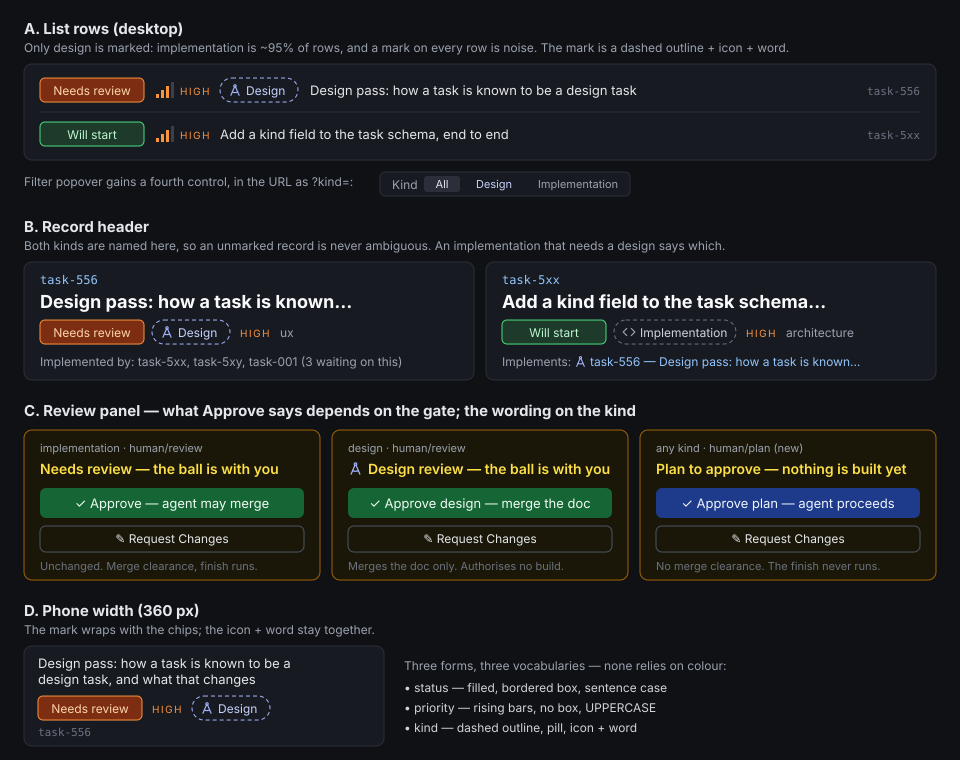

# Design tasks and implementation tasks

Design pass for task-555, recorded by task-556 on 2026-09-25. It settles how a task is
known to be a design task, what that changes, and which children build it. The binding
form of each decision is a `decision` entry on task-556; this page is the same argument
in one place, with the mockup.

## The finding that shapes everything else

task-555 frames this as one question — what kind of task is this — but the defect that
started it (task-001) is a different one: **what is this approval for.** They come apart
in both directions:

- **A design task usually merges something.** This page is a design task's deliverable,
  and it sits on a branch. Approving it has to merge the doc, so "a design approval
  never asserts merge clearance" would strand every design doc on its branch.
- **An implementation task can stop for a plan.** task-001's pilot was exactly this: an
  implementation task handed to a human to approve its plan before building. By then the
  branch already exists — the worktree is taken before the claim — so "does the task have
  a branch" cannot tell a plan gate from a result gate either.

And the second one is not only wording. With `finish.enabled`, pressing Approve starts a
scripted finish: rebase, gate, `--no-ff` merge. **Approving a plan on a task whose branch
already exists would merge the half-built branch.** The approve route cannot know it is
at a plan gate, because nothing on the record says so: `human/approval` is used today
both for re-approving a merge after a failed finish (task-230, task-213, task-092) and
for go-aheads on proposals with nothing to merge (task-209, task-288, task-290).

So there are two signals, and each gets its own home:

| Question | Signal | Set by | Lifetime |
|---|---|---|---|
| What *is* this task? | new field `kind` | whoever authors the task | the task's whole life |
| What does *this* approval authorise? | the handoff's `ball_reason`, with a new `human/plan` | the agent, at each handoff | one gate |

`kind` changes what the human sees and how an approval is worded. **It never changes
what an approval authorises** — the gate does. That split is what lets any actor edit
`kind` without it becoming a way to grant or skip a merge.

## 1. The discriminator: a `kind` field

`kind: design | implementation`, an optional top-level enum on the task. **Absent means
`implementation`.** No migration is required and no existing record changes meaning.

- **Surfaces.** The model, the LinkML source, a store column and SQL migration, the REST
  create and patch bodies, the read model, the generated client, MCP `task_create_*` and
  `task_update_content`, and the CLI (`create --kind`, shown by `show`). A value only the
  React app knows about is worse than none.
- **Default for new tasks.** `implementation`, by omission. An agent filing a design task
  sets `kind: design`; the workflow guide says so.
- **Existing tasks.** An explicit backfill of the *open* tasks that are design passes,
  each one written through `task_update_content` so its log records the change. Closed
  tasks are left alone.
- **Who may change it.** Any actor, through `task_update_content`, logged like
  `category`. This is safe only because of the split above: `kind` grants nothing.
- **General, but two members.** Widening an enum is cheap here — readers parse unknown
  members tolerantly (task-445) — so `research`, `chore` and the rest can be added the
  day one earns a behaviour. None does today.

**Rejected:**

- **Promote `category` to a validated enum.** `category` is the *topic* axis — 108 open
  and closed tasks are `ux`, 81 `infrastructure` — and a design task has a topic too
  (task-556 is `ux`). Making it carry kind would force a choice between the two for every
  design task.
- **A reserved tag.** Tags are unvalidated free text; `design` appears on 21 tasks today
  with no consistent meaning, beside `schema-design` and others. A tag cannot be a
  closed filter value or something a route may branch on.
- **Derive it from deliverables or links.** A docs-only implementation task also
  delivers a Markdown file (21 tasks are `documentation`), and a design pass may deliver
  only decision entries. The derivation would be wrong in both directions and invisible
  at creation.

## 2. The visual treatment

Three marks now sit side by side on a row, so each has its own *form* and none relies on
colour (the rule task-563 set for priority):

| Mark | Form | Vocabulary |
|---|---|---|
| status | filled, bordered box | sentence case |
| priority | rising bars, no box | UPPERCASE |
| **kind** | **dashed-outline pill, icon + word** | **Design** / **Implementation** |

- **List row.** Only `design` is marked. Implementation is the great majority of rows,
  and a mark on every one of them is noise that trains the eye to skip marks.
- **Record header.** Both kinds are named, so an unmarked record is never ambiguous
  between "implementation" and "not set". The header also names the link between them:
  an implementation task that `needs` a design task reads *Implements: task-NNN*, and the
  design task lists what is waiting on it. Derived from `dependencies[]` — no new field.
- **Review panel.** A design task's heading leads with the design mark and reads *Design
  review*; its Approve button says what it merges (*Approve design — merge the doc*).
- **Filter.** A fourth control in the filter popover, `?kind=all|design|implementation`
  in the URL.
- **Phone width.** The mark is one short word and a 14 px icon, and wraps with the
  other chips in the existing `flex-wrap` row; icon and word never separate.

**Rejected:** a coloured row stripe or left border (colour alone, and the status palette
already owns colour on a row); marking both kinds in the list (noise, above); a prefix in
the title (it is data, not presentation, and would be edited away).

## 3. Functional differences

| Candidate from task-555 | Verdict | Where |
|---|---|---|
| Approve on a design task approves the design and says so | **In, reshaped.** It still merges the doc — it must — and says that it authorises no implementation. What removes merge clearance is the new plan gate, below, for either kind. | task-001 |
| A plan gate that approves without merging (task-001's defect) | **In.** New human reason `plan`. | task-001 |
| Review shows the design deliverable rendered, not a diff | **In.** For any task whose deliverables include Markdown, read at the branch head. | its own child |
| Implementation links back to its design, visibly | **In**, folded into the GUI child: it is a line in the header derived from `needs`. | GUI child |
| Closing a design prompts filing or promoting implementation children | **Rejected.** The graph already does it: a design task files its children `ready` with `needs` on itself, and an epic walk starts each the moment the design closes. A prompt would duplicate that and still start nothing outside a walk. | — |
| Dispatch defaults by kind (model, posture, worktree, gate) | **Deferred.** No evidence yet of what a design task should run differently, and the gate question is task-101's and `gate_scope`'s. Reopen once `kind` has been set on a few weeks of tasks and their gate time can be measured. | — |

### The approve payload (task-001 against task-231's shape)

task-231 left `POST /{task_id}/approve` taking `NoteActionRequest` — `user` and an
optional `note` — and named the merge sentence `APPROVAL_CLEARANCE` as the seam.

- **The gate comes from the record, not the click.** The route reads the task's current
  `ball_reason` and composes the prompt from it:

  | gate (`ball_reason`) | prompt starts | finishable |
  |---|---|---|
  | `review`, `approval` | `APPROVAL_CLEARANCE` — cleared to merge, exactly as today | yes |
  | `plan` (new) | Plan approved — proceed. Nothing is merged and this task is not finished; build it and hand back to `human/review`. | **never** |

  For `kind: design` at `review`/`approval`, a second named constant replaces the first:
  cleared to merge *the design document*, and approving it authorises no implementation
  work, which is its own tasks. The regression test asserts each branch against its
  constant, as it does today.
- **The payload gains one optional field beside `note`:** `gate: "plan" | "final"`
  (`final` ⇔ `review`/`approval`, `plan` ⇔ `plan`). It is a guard, not a source: the UI
  sends what it showed, and the route refuses with 409 when it disagrees with the record.
  Without it, a panel rendered at a plan gate and clicked after the agent re-handed to
  review would merge on a button that said *proceed*. Omitted, the route behaves as
  today.
- **A plan approval is not merge authority anywhere else either.** Since task-312 an
  approval is also a receipt, and `standing_approval` reads the newest one as authority
  to merge. The receipt records the gate, and a plan receipt never counts.
- **Why a new reason rather than reusing `approval`.** `approval` already carries merge
  re-approvals; re-meaning it would turn those into plan approvals and stop their finish.
  Adding a value is additive under the schema's evolution policy.
- **Why a reason rather than a key in the handoff's `data`.** task-001's own spec, written
  in parallel with this pass, proposed `data.review_gate` on a `human/review` handoff: no
  schema change. It loses on three counts. `ball_reason` is the axis the panel already
  branches on (task-016) and the one `display_status` is derived from, so a reason makes
  the list say *Needs plan approval* with no new plumbing, and makes it filterable. A
  `data` key is a second value that can disagree with the reason — the schema already
  declined that shape once, for answered questions. And the cost it avoids is small here:
  the vocabulary rework it deferred to (task-226) is closed.

**Rejected:** a `gate` field in the payload that *decides* what is authorised (the click
would grant merge authority, and a UI bug could grant it at a plan gate); keying merge
clearance on `kind` (an implementation task's plan gate is the original defect, and any
actor may edit `kind`); keying it on whether a branch exists (the branch exists before
the plan does); the handoff-`data` carrier (above).

## 4. Relationship to task-101

**Kept separate, with this boundary.** task-555 decides what a task *is* and what one
approval *authorises in that act*. task-101 decides *whether* a human gate is required
before a merge at all — the admin default and per-task override. Nothing here changes
whether review is required: every merge still waits for the approval it waits for today.

Two things 101 inherits: `kind` is an available input to its policy (a design doc could
be the first thing a project exempts), and `human/plan` is one more gate its policy
enumerates. Folding it in was rejected because 101 is an unspecified draft with five open
owner questions, and this epic is at the top of the high band; bundling would block the
visible fix behind a policy nobody has decided.

## Children

Filed under task-555, each `ready` and each `needs` task-556, so none starts until this
design is approved and merged. Beyond that, a `needs` edge only where one genuinely
requires another:

1. **task-592 — `kind` end to end**: schema, store, REST, client, MCP, CLI, docs, and
   the logged backfill.
2. **task-593 — kind in the GUI**: list mark, header, review heading, filter,
   *Implements*; a sandbox seeded with both kinds. Needs task-592.
3. **task-001, re-specced — the plan gate**: `human/plan`, the approve prompt composed
   from gate and kind, the `gate` guard, a plan receipt that is never merge authority.
   Needs task-592, for the design-task wording.
4. **task-594 — Markdown deliverables rendered in the review panel.** Needs nothing
   but this design.

The epic's own last criterion — the owner reviewing both kinds side by side — is the
supervisor's, on the sandbox task-593 stands up.
